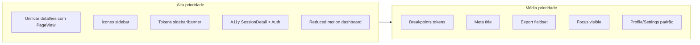

# Melhorias de UI/UX por rotas do frontend StudyTrackPro

## Mapa de rotas e views

| Rota                       | View                    | Layout usado                                       |
| -------------------------- | ----------------------- | -------------------------------------------------- |
| `/login`, `/register`      | LoginView, RegisterView | AuthLayout                                         |
| `/`                        | DashboardView           | AppLayout                                          |
| `/sessions`                | SessionsView            | AppLayout + PageView                               |
| `/sessions/technology/:id` | TechnologySessionsView  | AppLayout + PageView                               |
| `/sessions/:id`            | SessionDetailView       | AppLayout (sem PageView)                           |
| `/technologies`            | TechnologiesView        | AppLayout + PageView                               |
| `/technologies/:id`        | TechnologyDetailView    | AppLayout (BaseBreadcrumb próprio)                 |
| `/goals`                   | GoalsView               | AppLayout + PageView                               |
| `/export`                  | ExportView              | AppLayout + PageView                               |
| `/reports`                 | ReportsView             | AppLayout + PageView                               |
| `/help`                    | HelpView                | AppLayout + PageView                               |
| `/settings`                | SettingsView            | AppLayout + PageView                               |
| `/profile`                 | ProfileView             | AppLayout (sem PageView; breadcrumb/tabs próprios) |

---

## Problemas identificados

### 1. Inconsistência entre páginas de listagem e detalhe

- **SessionDetailView** e **TechnologyDetailView** não usam [PageView](frontend/src/components/layout/PageView.vue): cada um tem seu próprio header, botão "Voltar" e breadcrumb. Isso gera:
  - Hierarquia visual diferente das demais telas (Sessions, Technologies, Export, etc.).
  - Estilos locais para loading/erro em vez de reuso (ex.: ErrorCard, EmptyState).
  - SessionDetailView: texto "Carregando..." e bloco de erro sem `role`/`aria-live`; botão "← Voltar" sem ícone consistente e sem uso de componente base.

### 2. Navegação e identidade

- **Sidebar:** Perfil e Configurações usam o **mesmo ícone** (engrenagem) em [AppSidebar.vue](frontend/src/components/layout/AppSidebar.vue) (linhas 339–358 e 359–378), o que confunde identidade visual.
- **Meta de título:** Rotas dashboard, sessions e technologies não definem `meta.title`; apenas help, profile, settings, export, goals e reports definem. Falta padronizar e, se existir, conectar ao `document.title`.
- **Breadcrumb:** TechnologyDetailView monta breadcrumb manual; SessionDetailView não tem breadcrumb (só "← Voltar"). Padronizar com PageView onde fizer sentido (detalhes como filho da listagem).

### 3. Design system e tokens

- **Sidebar:** Cores hardcoded em [AppSidebar.vue](frontend/src/components/layout/AppSidebar.vue): `#8b5cf6`, `#22c55e`, `#f59e0b` em `sidebarSummary` (linhas 34–36); `.app-sidebar__pill.active` usa `color: #fff` (linha 377) em vez de `var(--color-primary-contrast)`.
- **AuthLayout:** [AuthLayout.vue](frontend/src/components/layout/AuthLayout.vue) usa `--spacing-2xl` no card; em `variables.css` não há `--spacing-2xl` definido no :root (existe `--spacing-2xl: 2.5rem` na linha 90). Verificar se 2xl está aplicado corretamente.
- **ActiveSessionBanner:** Usa `color: #fff` (linha 58); deveria usar `var(--color-primary-contrast)` ou token semântico para texto sobre primary.
- **Dashboard (modo padrão):** DashboardHeader e grid já usam variáveis; animação `fadeUpIn` não está envolvida em `prefers-reduced-motion`.

### 4. Acessibilidade

- **SessionDetailView:** Estados de loading e erro sem `role="status"` ou `aria-live="polite"`; botão "Voltar" sem `aria-label` explícito.
- **Auth (Login/Register):** AuthLayout não define landmark `main`; o card é o único conteúdo. Garantir `<main>` e heading único (h1) por página.
- **ExportView:** Radios de formato sem agrupamento por `<fieldset>`/`<legend>`; mensagem de sucesso já tem `role="status"` e `aria-live` (bom).
- **Foco:** Verificar se todos os links e botões da sidebar e do mobile header têm foco visível (ex.: `--shadow-focus` ou outline) em :focus-visible.

### 5. Responsividade

- **Breakpoints:** Em [variables.css](frontend/src/assets/styles/variables.css) o comentário cita 480, 640, 768, 1024, 1280; não há tokens `--screen-sm`, `--screen-md`, etc. Vários componentes usam `640px`, `768px`, `1024px` direto. Criar tokens de breakpoint e usar em media queries.
- **PageView:** Header com borda e padding; em 375px o hint e o título podem ficar apertados. Já existe `@media (max-width: 640px)` reduzindo padding.
- **Dashboard (Stakent):** Layout em grid; validar em 375px (uma coluna) e 1440px (sem largura máxima excessiva).
- **TechnologyDetailView / ProfileView:** Conteúdo denso; revisar colunas e tabs em mobile.

### 6. Estados vazios e erros

- **SessionDetailView / TechnologyDetailView:** Em erro, redirecionam (SessionDetail) ou mostram texto (TechnologyDetail); SessionDetail não usa ErrorCard nem EmptyState.
- **ReportsView:** EmptyState "Relatórios em desenvolvimento" é informativo; botão "Gerar relatório" faz apenas timeout (mock). Deixar claro que é placeholder ou desabilitar até a funcionalidade existir.
- **GoalsView:** Apenas GoalList dentro de PageView; se a API de Goals não existir, o estado vazio deve ser motivador (conforme design system).

### 7. Experiência da sessão ativa (timer)

- **ActiveSessionBanner:** Fica no topo do main em todas as páginas quando há sessão ativa; visualmente destacado (gradient, cor). Não existe rota dedicada `/session` para "modo foco" (timer em destaque, tela limpa). O design system recomenda "timer dominando a tela" em modo sessão — considerar rota ou modo zen no futuro.
- Banner: botão "Finalizar sessão" deve ter área de toque >= 44px e foco visível.

### 8. Duplicação e reuso

- **ProfileView:** Implementa seu próprio breadcrumb, tabs e cards; difere de SettingsView (que usa PageView + BaseTabs). Unificar padrão: ambas como PageView com tabs ou ambas com estrutura equivalente.
- **TechnologyDetailView:** Breadcrumb manual; SessionDetailView sem breadcrumb. Adotar PageView para detalhes (com título dinâmico e breadcrumb) ou criar componente "DetailPageLayout" reutilizável.

---

## Propostas de melhoria (priorizadas)

### Alta prioridade

1. **Unificar páginas de detalhe com PageView (ou DetailLayout)**
  - Fazer SessionDetailView e TechnologyDetailView usarem o mesmo padrão de página (PageView com breadcrumb + título + body).  
  - SessionDetailView: breadcrumb `Dashboard > Sessões > Sessão de estudo`; título "Sessão de estudo"; usar ErrorCard para erro e SkeletonLoader ou estado de loading padronizado.  
  - TechnologyDetailView: migrar para PageView com breadcrumb/título/subtítulo já suportados; manter conteúdo específico (mural, lembretes) no body.
2. **Corrigir ícones duplicados na sidebar**
  - Diferenciar Perfil e Configurações: por exemplo, ícone de usuário/pessoa para Perfil e engrenagem para Configurações (ou vice-versa), em [AppSidebar.vue](frontend/src/components/layout/AppSidebar.vue).
3. **Substituir hardcode por tokens na sidebar e no banner**
  - Sidebar: usar `var(--color-primary-contrast)` no `.app-sidebar__pill.active`; cores do resumo (Total de horas, Sessões, Streak) usar `var(--color-primary)`, `var(--color-success)`, `var(--color-warning)` em vez de #hex.  
  - ActiveSessionBanner: texto em branco via `var(--color-primary-contrast)`.
4. **Acessibilidade em SessionDetailView e Auth**
  - SessionDetailView: `role="status"` e `aria-live="polite"` para loading/erro; botão Voltar com `aria-label="Voltar para Sessões"`.  
  - AuthLayout: envolver conteúdo em `<main>` e garantir um único h1 por view (Login/Register).
5. **Respeitar prefers-reduced-motion no dashboard**
  - Em [DashboardView.vue](frontend/src/views/Dashboard/DashboardView.vue), envolver a animação `fadeUpIn` dos widgets em `@media (prefers-reduced-motion: no-preference)` ou aplicar classe que desativa animação quando `prefers-reduced-motion: reduce`.

### Média prioridade

1. **Tokens de breakpoint em variables.css**
  - Adicionar `--screen-xs: 480px`, `--screen-sm: 640px`, `--screen-md: 768px`, `--screen-lg: 1024px`, `--screen-xl: 1280px` e usar em media queries (ex.: `min-width: var(--screen-md)`) em AppLayout, AppSidebar, PageView, Dashboard e listagens.
2. **Meta title em todas as rotas**
  - Definir `meta: { title: '...' }` em dashboard, sessions, sessions-by-technology, session-detail, technologies, technology-detail.  
  - Se já existir, conectar ao Vue Router (afterEach) para definir `document.title`.
3. **ExportView: agrupamento semântico do formato**
  - Envolver os radios "CSV" / "JSON" em `<fieldset>` com `<legend>Formato</legend>` para a11y.
4. **Foco visível na sidebar e no mobile header**
  - Garantir que todos os RouterLink e botões (menu, fechar, logout, theme) tenham `:focus-visible` com `box-shadow: var(--shadow-focus)` ou equivalente (já existe `--shadow-focus` em variables.css).
5. **ProfileView e SettingsView: padrão consistente**
  - Decidir um padrão (ambas com PageView + BaseTabs + breadcrumb "Dashboard > ..."); ajustar ProfileView para usar PageView ou manter estrutura mas alinhar visualmente (mesmo estilo de card, espaçamento, título de seção).

### Baixa prioridade

1. **ReportsView: deixar claro que é placeholder**
  - Se "Gerar relatório" não gera PDF ainda, desabilitar botão e usar EmptyState com texto "Em breve: download em PDF" ou exibir aviso no hint.
2. **Rota ou modo “sessão ativa” (modo foco)**
  - Avaliar rota `/session` ou overlay fullscreen que exiba apenas timer + botão encerrar, conforme direção do design system (timer como elemento central durante a sessão).
3. **EmptyState e ErrorCard com roles/ARIA**
  - Revisar [EmptyState](frontend/src/components/ui/EmptyState.vue) e ErrorCard para `role="status"` e `aria-live` quando o conteúdo for dinâmico (ex.: após submit).

---

## Fluxo sugerido de implementação

Implementar primeiro os itens de alta prioridade (1 a 5), em seguida os de média (6 a 10), e por último os de baixa (11 a 13). Cada mudança deve manter `npm run build` e `npm run lint` verdes e, onde aplicável, validar em 375px e 1440px.

---

## Arquivos principais a alterar

| Melhoria                | Arquivos                                                                                                                                                                                                                                                                                                                                    |
| ----------------------- | ------------------------------------------------------------------------------------------------------------------------------------------------------------------------------------------------------------------------------------------------------------------------------------------------------------------------------------------- |
| PageView em detalhes    | [SessionDetailView.vue](frontend/src/views/sessions/SessionDetailView.vue), [TechnologyDetailView.vue](frontend/src/views/technologies/TechnologyDetailView.vue)                                                                                                                                                                            |
| Sidebar ícones e tokens | [AppSidebar.vue](frontend/src/components/layout/AppSidebar.vue)                                                                                                                                                                                                                                                                             |
| Banner e tokens         | [ActiveSessionBanner.vue](frontend/src/features/sessions/components/ActiveSessionBanner.vue)                                                                                                                                                                                                                                                |
| Reduced motion          | [DashboardView.vue](frontend/src/views/Dashboard/DashboardView.vue)                                                                                                                                                                                                                                                                         |
| Breakpoints             | [variables.css](frontend/src/assets/styles/variables.css), AppLayout, AppSidebar, PageView, Dashboard                                                                                                                                                                                                                                       |
| Meta title              | Todos os arquivos em [router/routes](frontend/src/router/routes/), possivelmente [guards](frontend/src/router/guards.ts) ou plugin                                                                                                                                                                                                          |
| Export a11y             | [ExportView.vue](frontend/src/views/export/ExportView.vue)                                                                                                                                                                                                                                                                                  |
| Auth main/h1            | [AuthLayout.vue](frontend/src/components/layout/AuthLayout.vue), LoginView, RegisterView                                                                                                                                                                                                                                                    |
| Profile/Settings        | [ProfileView.vue](frontend/src/views/profile/ProfileView.vue), [SettingsView.vue](frontend/src/views/settings/SettingsView.vue)                                                                                                                                                                                                             |
| Gráfico de horas        | [TimeSeriesWidget.vue](frontend/src/features/dashboard/components/TimeSeriesWidget.vue), [LineChart.vue](frontend/src/components/charts/LineChart.vue), [useApexChartTheme.ts](frontend/src/composables/useApexChartTheme.ts), [formatters.ts](frontend/src/utils/formatters.ts), [variables.css](frontend/src/assets/styles/variables.css) |

---

## Melhorar design do Dashboard

Objetivo: deixar o Dashboard mais claro, com hierarquia visual forte e identidade alinhada ao design system (dados como protagonistas, “densidade com respiro”, foco em progresso).

### Estado atual

- **Modo padrão (tema claro/escuro):** [DashboardHeader](frontend/src/features/dashboard/components/DashboardHeader.vue) com título, descrição, resumo em 3 colunas (Total de horas, Sessões, Último estudo), período e botão Atualizar; grid de widgets (LogSessionWidget, RemindersWidget, TodaySummaryCard, KpiCards, GoalsWidget, TimeSeriesWidget, WeeklyComparisonWidget, TechDistributionWidget); área de conteúdo com fundo `color-mix` e bordas; animação `fadeUpIn` já respeita `prefers-reduced-motion`.
- **Modo Stakent (dark):** layout em blocos (métricas recomendadas, feature card, sessão ativa) com cores hardcoded (#8b5cf6, #22c55e, #f59e0b) em [DashboardView](frontend/src/views/Dashboard/DashboardView.vue) e [StakentMetricCard](frontend/src/features/dashboard/components/StakentMetricCard.vue).

### Propostas de melhoria (Dashboard)

1. **Hierarquia visual**
  - Deixar o **card “Registrar estudo”** (CTA principal) como primeiro elemento de ação: manter em destaque no topo (já está), mas opcionalmente usar variante de card com borda/ênfase (ex.: `--shadow-session-glow` ou borda primary sutil) para diferenciar de widgets só leitura.
  - Ordem de leitura clara: 1) Ação (registrar) + lembretes; 2) Hoje + KPIs; 3) Metas; 4) Gráficos (evolução, semana, tecnologias). O grid atual já segue essa lógica; revisar apenas contraste visual entre “ação” e “dados”.
2. **Header do Dashboard**
  - **Opção A (editorial):** título mais forte (ex.: `--text-2xl` ou `--text-3xl`), menos elementos no mesmo bloco; resumo (Total de horas, Sessões, Último estudo) pode virar mini-cards abaixo do título ou integrar-se ao primeiro row de KPIs para evitar duplicação.
  - **Opção B (compacto):** manter header em uma linha com título + período + Atualizar; mover o resumo de 3 colunas para dentro do grid (ex.: como primeira linha de StatCards), liberando espaço e reduzindo ruído.
  - Garantir que o header use apenas tokens (`--spacing-`*, `--radius-`*, `--shadow-*`, `--color-*`); spinner de “Atualizando...” já usa variáveis.
3. **Cards de métrica (KPI e Resumo de hoje)**
  - **StatCard / KpiCards:** números com tipografia mais marcante (ex.: `--text-2xl` ou `--text-3xl`, `font-variant-numeric: tabular-nums`); considerar token `--font-mono` para valores numéricos (já citado no design system). Ícones: manter emojis por simplicidade ou trocar por ícones SVG do mesmo estilo da sidebar para consistência.
  - **TodaySummaryCard:** alinhar estilos a tokens; chip de tecnologias com `--radius-full` e cor da tech vinda de token ou variável (evitar `#3b82f6` hardcoded no fallback).
  - Hover nos cards: usar `--shadow-card-hover` e transição suave (já existe em KpiCards); garantir que não haja sombra idêntica em todos (hierarquia).
4. **Área de conteúdo e grid**
  - Trocar breakpoints fixos (640px, 1024px) por tokens quando existirem (`--screen-sm`, `--screen-lg`).
  - Revisar `dashboard__content`: fundo e padding já usam variáveis; opcional aumentar levemente `--page-section-gap` ou gap do grid em desktop para mais “respiro” sem perder densidade.
  - Empty state (nenhum dado ainda): já usa EmptyState com ícone e descrição; texto pode ser mais motivador (“Sua primeira sessão desbloqueia métricas e gráficos”) e garantir contraste e `role="status"`.
5. **Modo Stakent**
  - Substituir `#8b5cf6`, `#22c55e`, `#f59e0b` por `var(--color-primary)`, `var(--color-success)`, `var(--color-warning)` (ou tokens de accent do tema Stakent em [variables.css](frontend/src/assets/styles/variables.css), se houver).
  - StakentMetricCard e seção “Recomendado para as próximas 24h”: usar mesmos tokens de cor do tema dark/Stakent para manter consistência.
6. **Gráficos (TimeSeries, WeeklyComparison, TechDistribution)**
  - Garantir que as cores dos gráficos venham da paleta do design system (ex.: primary, success, warning, cores de tecnologia); não usar defaults do ApexCharts sem mapear para tokens.
  - Títulos e eixos: `--widget-title-size`, `--widget-title-color`, `--color-text-muted` para labels.

---

### Gráfico de horas do dashboard (TimeSeriesWidget + LineChart) — melhorias específicas

O gráfico que mostra evolução de tempo estudado por dia ([TimeSeriesWidget.vue](frontend/src/features/dashboard/components/TimeSeriesWidget.vue) + [LineChart.vue](frontend/src/components/charts/LineChart.vue)) hoje usa área (area chart) com minutos no eixo Y, grid tracejado e título "Minutos por dia". Abaixo, melhorias para deixá-lo mais legível, consistente com o design system e visualmente mais agradável.

#### Problemas atuais

- **Eixo Y em minutos brutos:** Valores como 60, 120, 180 no eixo e no tooltip ("120 min") são pouco intuitivos; o usuário pensa em "horas de estudo".
- **Título e copy:** "Minutos por dia (7d/30d/90d)" é técnico; falta uma âncora visual (ex.: total do período em horas).
- **Grid:** `strokeDashArray: 4` em x e y (em [useApexChartTheme.ts](frontend/src/composables/useApexChartTheme.ts)) deixa o fundo carregado; linhas em excesso.
- **Tipografia dos eixos:** Labels usam `--text-xs` (0.75rem); em gráfico grande podem ficar pequenos ou pouco legíveis.
- **Eixo X com muitos pontos:** Em 90 dias, muitas labels (datas) podem sobrepor ou ficar ilegíveis; não há `tickAmount` ou rotação configurada no LineChart.
- **Gradiente da área:** Uma única cor (primary) com opacidade 0.35 → 0.05; aspecto genérico, sem refinamento (stops, tom).
- **Placeholder:** "Sem dados" no LineChart é seco; o widget não oferece estado vazio motivador ou CTA.
- **Altura fixa:** 180px (mobile) / 220px (desktop) pode comprimir a linha quando há muitos pontos; sem sensação de “respiro”.
- **Animação:** Entrada padrão do ApexCharts; o design system sugere “animação de entrada de baixo para cima” para gráficos.

#### Propostas de melhoria (gráfico de horas)

1. **Eixo Y e tooltip em horas (não minutos)**
  - No [LineChart.vue](frontend/src/components/charts/LineChart.vue) (ou em opções passadas pelo TimeSeriesWidget): eixo Y com `labels.formatter` convertendo minutos → "1h", "2h", "30min" (ou "0,5h").  
  - Tooltip: em vez de "X min", usar "Xh Ymin" ou "Xh" quando redondo (ex.: 90 → "1h 30min", 120 → "2h").  
  - Manter dados internos em minutos; só a apresentação muda. Opcional: prop `valueUnit: 'minutes' | 'hours'` no LineChart para reuso em outros contextos.
2. **Título e resumo do período**
  - Em [TimeSeriesWidget.vue](frontend/src/features/dashboard/components/TimeSeriesWidget.vue): trocar título para algo como **"Tempo estudado por dia"** ou **"Horas por dia"** e manter o período entre parênteses (7 dias, 30 dias, 90 dias).  
  - Opcional: exibir um número âncora no header do widget (ex.: "Total no período: 12h 30min") calculado a partir de `timeSeries` para dar hierarquia e contexto.
3. **Grid mais limpo**
  - Em [useApexChartTheme.ts](frontend/src/composables/useApexChartTheme.ts) ou sobrescrevendo no LineChart: reduzir ruído do grid — por exemplo apenas linhas horizontais (`xaxis.lines.show: false`), ou grid com `strokeDashArray: 0` (linha sólida) e cor mais suave (`color-mix` com transparent), ou menos linhas (yaxis.tickAmount).  
  - Objetivo: gráfico legível sem “poluição visual”.
4. **Tipografia dos eixos**
  - Usar `--text-sm` para labels dos eixos no gráfico de tempo (ou novo token `--chart-axis-font-size` em variables.css) em vez de `--text-xs`, para melhor leitura.  
  - Garantir contraste: labels em `--color-text-muted` (já usado); evitar cinza muito claro.
5. **Eixo X: rotação e quantidade de ticks**
  - No LineChart (ou baseOptions para este tipo): para muitos pontos (ex.: 90), definir `xaxis.tickAmount` (ex.: ~8–12) ou `xaxis.labels.rotate: -45` e `xaxis.labels.maxHeight` para evitar sobreposição.  
  - Manter formato de data curto (ex.: "25/01") já usado em `formatShortDate`.
6. **Gradiente e cor da área**
  - Refinar o fill do area chart: usar `gradient.shade: 'dark'` ou `'light'` conforme tema (dark/light), e ajustar `opacityFrom`/`opacityTo` (ex.: 0.25 → 0.02) para um desvanecimento mais suave.  
  - Opcional: segundo stop no gradiente (ex.: 50%) para controle fino; cor continua vinda de `theme.palette[0]` (primary) para manter design system.
7. **Estado vazio**
  - Quando não houver dados, exibir no widget um estado vazio motivador (texto + ícone/ilustração), por exemplo: "Nenhum registro neste período. Registre sessões para ver sua evolução aqui." com link ou botão para "Registrar sessão" (navegação para o card de registro).  
  - Reutilizar componente EmptyState com props adequadas em vez do "Sem dados" genérico do LineChart.
8. **Altura e proporção**
  - Aumentar levemente a altura do gráfico no desktop (ex.: `--widget-chart-min-height` de 220px para 260px em variables.css, ou criar `--widget-chart-min-height-tall` para este widget) para dar mais presença e evitar linha “espremida” em 90 dias.  
  - Manter responsivo: em mobile a altura menor pode permanecer.
9. **Animação de entrada**
  - Configurar no ApexCharts (chart.animations) uma animação de “subida” (easing suave, duração com `--duration-slow` ou ~400ms) para a série aparecer de baixo para cima, alinhado ao design system.  
  - Respeitar `prefers-reduced-motion: reduce` desativando ou reduzindo animação (ApexCharts permite desligar animations).
10. **Acessibilidade**
  - Garantir que o widget tenha um `aria-label` ou título associado ao gráfico (ex.: "Gráfico de tempo estudado por dia no período selecionado").  
    - Tooltip e leitura por leitores de tela: ApexCharts gera estrutura própria; verificar se o container do chart tem role/aria adequados quando houver foco em elementos interativos.

#### Arquivos a alterar

| Alteração                     | Arquivo(s)                                                                                                                 |
| ----------------------------- | -------------------------------------------------------------------------------------------------------------------------- |
| Eixo Y e tooltip em horas     | [LineChart.vue](frontend/src/components/charts/LineChart.vue) (formatters no yaxis e tooltip); opcional prop para unidade  |
| Título, resumo e estado vazio | [TimeSeriesWidget.vue](frontend/src/features/dashboard/components/TimeSeriesWidget.vue)                                    |
| Grid e tipografia base        | [useApexChartTheme.ts](frontend/src/composables/useApexChartTheme.ts) ou overrides no LineChart                            |
| Eixo X (ticks/rotação)        | [LineChart.vue](frontend/src/components/charts/LineChart.vue) (xaxis options)                                              |
| Gradiente e animação          | [LineChart.vue](frontend/src/components/charts/LineChart.vue) (fill, chart.animations)                                     |
| Altura do widget              | [variables.css](frontend/src/assets/styles/variables.css) (opcional novo token) ou TimeSeriesWidget (classe específica)    |
| Formatação "Xh Ymin"          | [formatters.ts](frontend/src/utils/formatters.ts) (nova função `formatMinutesToHoursLabel`) para reuso no tooltip e eixo Y |

Ordem sugerida de implementação: (1) formatação em horas (eixo Y + tooltip); (2) título e copy do widget; (3) grid e tipografia; (4) eixo X e gradiente; (5) estado vazio e altura; (6) animação e a11y.

---

## Widget Distribuição por tecnologia (TechDistributionWidget) — melhorias de cores e layout

O widget exibe um gráfico de pizza/rosquinha/barras com a distribuição de horas por tecnologia e uma lista lateral. Na prática, as cores ficam caóticas com muitas tecnologias e o layout (legenda + lista) poluído.

### Problemas atuais

**Cores**

- Fundo do widget fixo em `#0d0d18` (linha 451) — não usa design system; quebra em tema claro.
- Título com gradiente hardcoded `#fff` e `rgba(160, 140, 255, 0.9)` e `-webkit-text-fill-color: transparent`.
- Badge do total, botões do toggle e centro do gráfico usam `#fff` ou rgba fixos em vez de `var(--color-primary-contrast)` / `var(--color-text)`.
- Container do chart: `rgba(255,255,255,0.02)` e `rgba(255,255,255,0.06)`; sombra `#000`; info-cards com cores fixas.
- Com 20+ tecnologias, a paleta usa muitas cores distintas (palette[0]..[7], depois ciclo) — visual “arco-íris” e pouco harmônico.
- Texto do centro (“1.7k h”) em branco pode ter pouco contraste em fatias claras.

**Layout**

- Legenda do ApexCharts em `position: 'bottom'` com muitos itens vira um bloco denso e difícil de escanear.
- Redundância: legenda abaixo do gráfico e lista à direita mostram as mesmas tecnologias e cores.
- Lista lateral: espaçamento e hierarquia podem melhorar; fonte pequena (`--text-xs`).
- Hint no rodapé (“Clique em uma fatia…”) compete visualmente com o conteúdo.
- Em telas médias, proporção chart vs lista e gaps podem ser ajustados para mais respiro.
- Botões “Pizza / Rosquinha / Barras”: ativo com `color: #fff`; falta foco visível (a11y).

### Propostas de melhoria (TechDistributionWidget)

1. **Respeitar o tema (claro/escuro)**
  - Trocar `background: #0d0d18` por `var(--color-bg-card)` ou, se o widget for sempre “elevado”, por `var(--color-bg-soft)`.  
  - Remover o `::before` com textura se estiver fixo em escuro; ou torná-lo condicional ao tema (opacity menor no claro).  
  - Garantir que título, badge, centro do gráfico e lista usem `var(--color-text)`, `var(--color-text-muted)` e `var(--color-primary-contrast)` quando sobre fundo primary.
2. **Título e badge com tokens**
  - Título: usar `color: var(--color-text)` e, se quiser ênfase, gradiente suave com `var(--color-primary)` (ex.: `linear-gradient(135deg, var(--color-text), var(--color-primary))`) em vez de #fff e roxo fixo. Evitar `-webkit-text-fill-color: transparent` se prejudicar acessibilidade.  
  - Badge do total: `background: var(--color-bg-soft)`, `color: var(--color-text-muted)`, `border: 1px solid var(--color-border)`.
3. **Paleta harmônica para muitas fatias**
  - Quando há mais de 8–10 tecnologias, não ciclar cores aleatórias da palette. Opções:  
    - **Opção A:** Gerar tons a partir de uma base (ex.: `var(--color-primary)`) com variação de saturação/luminosidade (ex.: 5–6 tons) e repetir em ciclo.  
    - **Opção B:** Usar apenas as primeiras N cores da palette do tema (ex.: 6) e repetir com opacidade ou “clarear/escurecer” para distinguir fatias.
  - Manter cor da tecnologia quando existir (`m.technology?.color`); fallback com a paleta harmônica.
4. **Remover ou simplificar a legenda do gráfico**
  - Como a lista à direita já mostra nome + cor + horas, definir `legend: { show: false }` no ApexCharts para o pie/donut e confiar na lista.  
  - Reduz poluição visual e elimina redundância; o centro do donut (total ou fatia selecionada) continua como âncora.
5. **Lista lateral: tipografia e espaçamento**
  - Aumentar levemente o tamanho do nome da tecnologia (ex.: `--text-sm`) e manter horas em `--text-xs` com `var(--color-text-muted)`.  
  - Aumentar `padding` dos itens e gap entre lista e chart (ex.: `var(--spacing-md)`).  
  - Garantir que o painel use `var(--color-bg-soft)`, `var(--color-border)` e `var(--color-bg-card)` para fundo da lista.  
  - Botão do toggle (Tecnologias (N)): foco visível com `outline: none` + `box-shadow: var(--shadow-focus)` em `:focus-visible`.
6. **Container do chart e centro**
  - Fundo do `.chart-wrap`: `var(--color-bg-soft)` ou `color-mix(in srgb, var(--color-bg-card) 98%, var(--color-bg-soft))`; borda `var(--color-border)`.  
  - Sombra: usar `var(--shadow-md)` ou `var(--shadow-sm)` em vez de valores fixos com #000.  
  - Label do centro (total / nome + %): `color: var(--color-text)`; se o centro for sobre uma fatia clara, considerar um fundo semitransparente ou contorno sutil para legibilidade.  
  - dropShadow do ApexCharts: usar cor derivada do tema (ex.: `var(--color-text)` com baixa opacidade) em vez de `#000`.
7. **Botões Pizza / Rosquinha / Barras**
  - Ativo: `background: var(--color-primary)`, `color: var(--color-primary-contrast)`.  
  - Toggle container: `background: var(--color-bg-soft)`, `border: 1px solid var(--color-border)`.  
  - Adicionar `:focus-visible` com `box-shadow: var(--shadow-focus)` em cada botão.
8. **Info-cards (fatia selecionada)**
  - Fundo e borda usando tokens (ex.: `var(--color-bg-card)`, `var(--color-border)`); barra de destaque com `var(--card-color)` da tecnologia.  
  - Texto: `var(--color-text-muted)` para label e `var(--color-text)` para valor (ou cor da tech se for intencional).  
  - Evitar cores fixas tipo `rgba(18,18,28,0.96)` para funcionar em tema claro.
9. **Hint e hierarquia**
  - Reduzir ênfase do hint (“Clique em uma fatia…”): `font-size: var(--text-xs)`, `color: var(--color-text-muted)`, margem adequada para não competir com o gráfico.  
  - Opcional: mover o hint para um tooltip no ícone de ajuda ou abreviar.
10. **Layout responsivo e respiro**
  - Em viewports largos: aumentar o gap entre área do chart e painel (ex.: `var(--spacing-xl)`).  
    - Largura do painel: manter 260px ou usar `min-width` + `max-width` com token.  
    - Em mobile: manter empilhamento (chart em cima, lista abaixo) e garantir que a lista colapsável tenha altura máxima confortável e scroll suave.

---

### Espaçamento, dimensionamento do gráfico de barras e animações

#### Problemas atuais

**Espaçamento**

- **Pie/Donut:** Fatias são desenhadas coladas (sem gap entre elas); com muitas fatias finas, o resultado fica denso e confuso. O ApexCharts não oferece “offset” nativo entre fatias; é possível dar sensação de espaço com `stroke` mais largo na cor do fundo ou com `plotOptions.pie.offsetX/offsetY` e tamanho menor do raio.
- **Barras:** `barWidth = 24` e `barGap = 8` (constantes no script). Com 20+ tecnologias a altura do SVG fica enorme (`barChartHeight = n * 32 - 8`) e o container `.chart-wrap--bar` tem **altura fixa 340px**. O `viewBox` dinâmico (ex.: 736px de altura com 22 itens) é comprimido com `preserveAspectRatio="xMidYMid meet"`, deixando barras e labels minúsculos e mal legíveis — **gráfico de barras mal dimensionado**.
- Labels do bar chart em `<text x="0">` não têm limite de largura nem ellipsis; nomes longos invadem a área das barras.

**Dimensionamento do gráfico de barras**

- Altura do container fixa (340px) vs. altura do conteúdo proporcional ao número de itens.
- Largura fixa 280px; área útil das barras `barChartWidth - 80 = 200px`; início das barras em x=60 deixa pouco espaço para o texto à esquerda.
- Não há scroll nem “top N” quando há muitas tecnologias; tudo é espremido.

**Animações**

- Pie/Donut já usa animações do ApexCharts (speed 900, animateGradually). Não há transição ao **trocar de tipo** (Pizza → Rosquinha → Barras).
- Gráfico de barras é SVG estático: **sem animação de entrada** (barras poderiam crescer de largura 0 ou scaleY de 0→1).
- Overlay e fatia explodida já têm transição; troca de vista (pie ↔ bar) é instantânea.

#### Propostas de melhoria

**1. Espaçamento no Pie/Donut**

- Aumentar levemente o `stroke.width` das fatias e usar `stroke.colors` com a cor do fundo do container (`var(--color-bg-soft)` ou `chartTheme.background`) para criar um “filete” entre fatias e melhorar a leitura quando há muitas fatias.
- Opcional: reduzir um pouco o raio efetivo (ex.: `plotOptions.pie.size` ou donut `size`) para dar mais margem visual em relação à borda.

**2. Gráfico de barras bem dimensionado**

- **Altura:** Em vez de container fixo 340px com viewBox gigante espremido, usar uma das abordagens:
  - **Opção A (recomendada):** Área rolável com altura fixa (ex.: 360px). viewBox com altura proporcional aos itens; o wrapper do SVG com `overflow-y: auto` e altura fixa (ex.: 360px). Assim cada barra mantém tamanho legível (barWidth + barGap por linha) e o usuário rola para ver o restante.
  - **Opção B:** Limitar a **top N** tecnologias (ex.: 12) no gráfico de barras e exibir “Ver todas na lista” ou link para a lista lateral; assim a altura do SVG fica limitada (ex.: 12 * 32 + 40 ≈ 424px) e cabe no container com altura ~360px sem scroll.
- **Dimensões de barra e gap:** Usar tokens ou constantes mais generosas: ex. `barHeight` (altura de cada barra) 28–32px e `barGap` 12–16px (via `var(--spacing-sm)` / `var(--spacing-md)`), para melhor leitura. Se usar scroll (Opção A), manter `barChartHeight = slices.length * (barHeight + barGap) - barGap`.
- **Largura:** Aumentar `barChartWidth` em telas maiores (ex.: 320px ou 100% do container com max-width) e garantir área das barras (`barChartWidth - labelArea`) proporcional; label area à esquerda com largura mínima (ex.: 120px) e labels com `max-width` + `text-overflow: ellipsis` (em SVG pode ser via `<title>` + truncar texto ou via foreignObject com CSS).
- **Labels:** Truncar nomes longos (ex.: máx. 18–20 caracteres + "…") no texto do eixo ou exibir tooltip com nome completo; alinhar à direita do espaço de labels (ex.: x = labelArea - 4) para não sobrepor as barras.

**3. Animações**

- **Troca de tipo (Pizza / Rosquinha / Barras):** Envolver o bloco do chart (pie/donut vs. bar) em `<Transition>` (ex.: `name="chart-switch"`) com `mode="out-in"`: fade + leve scale (ex.: opacity 0→1, transform scale(0.98)→1) em ~200–300ms com `var(--duration-normal)` e `var(--ease-out-expo)` para não parecer brusco.
- **Entrada do gráfico de barras:** Ao exibir a vista de barras, animar cada barra de largura 0 até o valor (ou scaleX de 0 a 1 na origem à esquerda). Implementação possível com CSS (ex.: clip-path ou transform-origin left + scaleX) e transition na largura/scale, ou com pequeno delay por índice (stagger 30–50ms por barra) para efeito em cascata. Respeitar `prefers-reduced-motion: reduce` (sem animação ou duração mínima).
- **Pie/Donut:** Manter animação atual do ApexCharts; opcional suavizar ainda mais (speed 600–700) e garantir que, ao trocar entre Pizza e Rosquinha, a transição use o mesmo `<Transition>` acima.

**4. Tokens e CSS**

- Definir em `variables.css` (opcional) ou no componente: `--chart-bar-height`, `--chart-bar-gap`, `--chart-bar-label-width` para padronizar e facilitar ajustes. Usar `var(--spacing-sm)` / `var(--spacing-md)` para gaps se não criar tokens específicos.
- Container do bar chart: `min-height` e `max-height` com tokens (ex.: `var(--widget-chart-min-height)` e 360px ou 400px) e, se Opção A, `overflow-y: auto` com classe de scroll elegante (`.scroll-pretty` ou similar).

#### Resumo técnico (gráfico de barras)

| Aspecto                      | Atual            | Proposta                                                                      |
| ---------------------------- | ---------------- | ----------------------------------------------------------------------------- |
| Altura container bar         | 340px fixo       | 360px (ou token) com área rolável (overflow-y: auto) ou limitar a top N itens |
| Altura viewBox bar           | n*32-8+40        | Manter proporcional; wrapper com altura fixa + scroll                         |
| barWidth / barGap            | 24 / 8           | 28–32 / 12–16 (ou tokens)                                                     |
| Labels bar                   | x=0, sem truncar | Largura reservada ~120px; truncar + tooltip ou ellipsis                       |
| Troca Pizza/Rosquinha/Barras | Instantânea      | Vue Transition (fade + scale), ~250ms                                         |
| Entrada das barras           | Nenhuma          | Animação de largura/scaleX com stagger; respeitar reduced-motion              |

### Arquivos a alterar

| Alteração                                                                                                                                 | Arquivo                                                                                                                                                                      |
| ----------------------------------------------------------------------------------------------------------------------------------------- | ---------------------------------------------------------------------------------------------------------------------------------------------------------------------------- |
| Cores, tema, título, badge, container, legend off, botões, lista, info-cards, hint                                                        | [TechDistributionWidget.vue](frontend/src/features/dashboard/components/TechDistributionWidget.vue)                                                                          |
| Espaçamento pie/donut (stroke), dimensionamento e scroll/stagger do gráfico de barras, animações (transição de tipo + entrada das barras) | [TechDistributionWidget.vue](frontend/src/features/dashboard/components/TechDistributionWidget.vue)                                                                          |
| Paleta harmônica (opcional: função em composable ou utils)                                                                                | [TechDistributionWidget.vue](frontend/src/features/dashboard/components/TechDistributionWidget.vue) ou [useApexChartTheme.ts](frontend/src/composables/useApexChartTheme.ts) |
| Tokens opcionais (bar height, gap, label width)                                                                                           | [variables.css](frontend/src/assets/styles/variables.css)                                                                                                                    |

Ordem sugerida: (1) tema e tokens de cor no container/título/badge; (2) desligar legenda e ajustar lista; (3) **dimensionamento e scroll/top-N do gráfico de barras**; (4) **espaçamento (stroke no pie; barGap/barHeight)**; (5) **animações (transição de tipo + entrada das barras)**; (6) paleta harmônica; (7) botões e foco; (8) info-cards e centro do chart; (9) hint e espaçamentos.

---

1. **Resumo**
  - **Arquivos a tocar:** [DashboardView.vue](frontend/src/views/Dashboard/DashboardView.vue), [DashboardHeader.vue](frontend/src/features/dashboard/components/DashboardHeader.vue), [KpiCards.vue](frontend/src/features/dashboard/components/KpiCards.vue), [TodaySummaryCard.vue](frontend/src/features/dashboard/components/TodaySummaryCard.vue), [StatCard.vue](frontend/src/components/ui/StatCard.vue), [StakentMetricCard.vue](frontend/src/features/dashboard/components/StakentMetricCard.vue); widgets de gráficos (TimeSeriesWidget, TechDistributionWidget, etc.); [variables.css](frontend/src/assets/styles/variables.css) para tokens de breakpoint e `--font-mono` se não existir.
  - **Ordem sugerida:** (1) tokens de cor no Stakent e no resumo da sidebar; (2) hierarquia e header (escolher opção A ou B); (3) tipografia dos números e optional font-mono; (4) breakpoints como tokens no grid do dashboard; (5) paleta dos gráficos e empty state.

