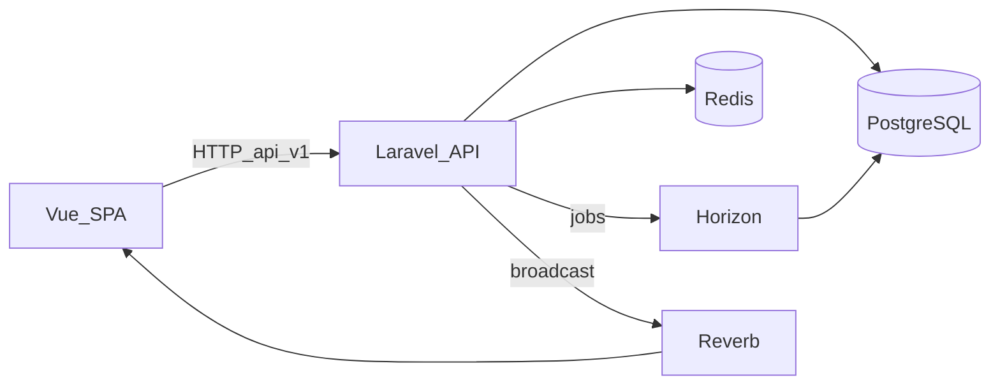

# Resumo de referência — StudyTrack Pro (para agentes)

Documento consolidado para agentes de IA trabalharem no repositório. Em caso de divergência com o código, **prevalece a implementação no código**.

## O que é

**StudyTrack Pro** é uma aplicação **full-stack** para desenvolvedores e estudantes **registrarem sessões de estudo**, vincularem tempo a **tecnologias**, ver **dashboard com KPIs**, **heatmap** (estilo GitHub), **distribuição por tech**, **streaks** e **exportação** de analytics. Autenticação com **Laravel Sanctum** (tokens); atualização em tempo real do dashboard via **WebSocket (Laravel Reverb + Echo)**.

**Metas (Goals)** no frontend podem ser **apenas localStorage** (ver [README.md](README.md) — não confundir com entidade persistida na API).

---

## Stack principal

| Camada | Tecnologia |
|--------|------------|
| Frontend | Vue 3, TypeScript, Vite 5, Pinia, Vue Router, **TanStack Vue Query**, PrimeVue 4, Axios, Zod, ApexCharts, Laravel Echo, @vueuse |
| Backend | Laravel 11, PHP 8.2, Sanctum, Reverb, Horizon |
| Dados | PostgreSQL 16 — schema **`public`** (transacional) e **`analytics`** (métricas pré-calculadas) |
| Infra app | Redis 7 (cache com tags, filas, scripts Lua), Docker Compose, OpenResty na borda |

---

## Estrutura do repositório (macro)

- [`backend/`](backend/) — API Laravel; módulos de domínio em `app/Modules/` (**Auth**, **StudySessions**, **Technologies**, **Analytics**); `Events`, `Listeners`, `Jobs`; controllers em `Http/Controllers/V1/`; rotas em [`backend/routes/api.php`](backend/routes/api.php).
- [`frontend/`](frontend/) — SPA: `src/api/`, `components/` (ui, layout, charts), `features/<domínio>/`, `stores/`, `router/`, `types/`, `composables/`.
- [`docker/`](docker/) — imagens e configs (OpenResty, PHP, Postgres, Redis, etc.).
- [`redis-scripts/`](redis-scripts/) — Lua: dedup de jobs, sliding window (rate limit), streak.
- [`docs/`](docs/) — índice em [`docs/README.md`](docs/README.md); técnico em [`docs/technical/DOCUMENTACAO_TECNICA.md`](docs/technical/DOCUMENTACAO_TECNICA.md) e Lua/OpenResty em [`docs/technical/DOCUMENTACAO_TECNICA_LUA.md`](docs/technical/DOCUMENTACAO_TECNICA_LUA.md).
- [`.cursor/rules/`](.cursor/rules/) — regras por contexto (ex.: frontend aponta para o prompt em `docs/agents/`).

---

## API (visão do agente)

- Prefixo versionado: **`/api/v1`** (detalhes e limites em [`backend/README.md`](backend/README.md)).
- Auth: `register`, `login`; com token: `me`, perfil, senha, listagem/revogação de tokens.
- Domínio: CRUD **technologies**, **study-sessions** (incl. `start`, `end`, `active`), **analytics** (`dashboard`, `user-metrics`, `tech-stats`, `time-series`, `weekly`, `heatmap`, `export`).
- Há **throttle** por grupo (login/register/search/sensitive/export) e **sliding window** em rotas de escrita de sessões (`throttle.sliding` + middleware dedicado).

Trecho ilustrativo das rotas:

```php
// backend/routes/api.php (trecho)
Route::prefix('v1')->name('v1.')->group(function () {
    Route::middleware('throttle:login')->group(function () {
        Route::post('auth/register', [\App\Http\Controllers\V1\AuthController::class, 'register'])
            ->middleware('throttle:register');
        Route::post('auth/login', [\App\Http\Controllers\V1\AuthController::class, 'login']);
    });

    Route::middleware(['auth:sanctum'])->group(function () {
        Route::prefix('analytics')->name('analytics.')->group(function () {
            Route::get('dashboard', [\App\Http\Controllers\V1\AnalyticsController::class, 'dashboard']);
            // ...
        });
    });
});
```

---

## Arquitetura backend (padrões)

- **Controller → Service → Repository (contract + Eloquent)**; Form Requests para validação.
- **Event-driven**: mudanças em sessões disparam eventos; **listeners** invalidam cache, enfileiram jobs, broadcast quando aplicável.
- **Recálculo de métricas**: job (ex. `RecalculateMetricsJob` na fila `metrics`, com delay para agrupar) atualiza tabelas em `analytics`, **flush de cache** por tags/usuário, evento **`MetricsRecalculated`** para o cliente.
- **Cache**: `Cache::tags([...])` para invalidação seletiva (dashboard, heatmap, etc., conforme README).



---

## Frontend (padrões para o agente)

- Dados de servidor: **TanStack Vue Query** + módulos em `api/`; chaves centralizadas em [`frontend/src/api/queryKeys.ts`](frontend/src/api/queryKeys.ts).
- Estado local / auth UI: **Pinia**.
- Organização por **feature** (`features/dashboard`, `sessions`, `technologies`, `goals`, etc.) com composables de query/timer.
- Contratos: **`types/`** e **`schemas/`** (Zod) alinhados à API.
- Queries que dependem de sessão autenticada: usar **`useQuerySessionEnabled`** de [`frontend/src/composables/useQueryAuthEnabled.ts`](frontend/src/composables/useQueryAuthEnabled.ts) com keys centralizadas.

---

## Infra e comandos

- Compose principal + overlay dev: [`docker-compose.yml`](docker-compose.yml), [`docker-compose.dev.yml`](docker-compose.dev.yml); automação em [`Makefile`](Makefile) (`make dev`, `make test`, shells PHP/Node, migrate).
- URLs típicas (README): app em `http://localhost`, Vite `5173`, health `/api/health`, Horizon `/horizon`.

---

## Testes e CI

- Backend: **PHPUnit** em `backend/tests/` (Feature inclui contratos, segurança, Lua, sessões, etc.).
- Frontend: **Vitest** em `frontend/src/**/__tests__`.
- Workflows em [`.github/workflows/`](.github/workflows/) (backend-ci, frontend-ci).

---

## Onde aprofundar (sem adivinhar implementação)

| Necessidade | Onde olhar |
|-------------|------------|
| Endpoints e rate limits | [`backend/README.md`](backend/README.md), [`backend/routes/api.php`](backend/routes/api.php) |
| Visão técnica longa | [`docs/technical/DOCUMENTACAO_TECNICA.md`](docs/technical/DOCUMENTACAO_TECNICA.md) |
| Redis/Lua/OpenResty | [`docs/technical/DOCUMENTACAO_TECNICA_LUA.md`](docs/technical/DOCUMENTACAO_TECNICA_LUA.md) |
| Frontend (prompt detalhado) | [`docs/agents/prompt-agente-frontend-studytrackpro.md`](docs/agents/prompt-agente-frontend-studytrackpro.md) (citado em [`.cursor/rules/frontend-studytrackpro.mdc`](.cursor/rules/frontend-studytrackpro.mdc)) |
| Agente full-stack | [`docs/agents/prompt-agente-fullstack-studytrackpro.md`](docs/agents/prompt-agente-fullstack-studytrackpro.md) |
| Estratégia de testes | [`docs/testing/ESTRATEGIA_TESTES.md`](docs/testing/ESTRATEGIA_TESTES.md) |

---

## Princípios para o agente ao editar código

- Manter escopo **focado** na tarefa; seguir estilo e camadas já usadas no arquivo.
- Backend: respeitar **módulos**, **events/listeners/jobs** e **schemas** de banco (`transactional/` vs analytics nas migrations).
- Frontend: **API via `api/`**, tipos/schemas consistentes, **Query vs Pinia** conforme padrão existente.
- Não assumir que tudo está na documentação: em dúvida, **o código é a fonte da verdade** (a própria documentação técnica diz isso).
