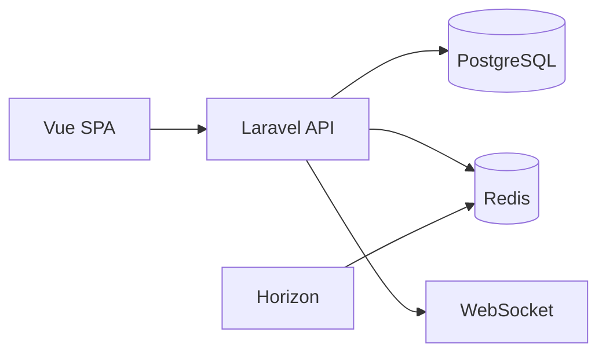

# StudyTrack Pro

[](https://github.com/hatanaca/studyStackPro/actions/workflows/backend-ci.yml)
[](https://github.com/hatanaca/studyStackPro/actions/workflows/frontend-ci.yml)

Plataforma de análise de sessões de estudo: registro, métricas e dashboard em tempo real.

**Demo:** [em breve]

## Stack

| Tecnologia | Motivação |
|------------|-----------|
| Vue 3 + TypeScript | SPA reativa, tipagem estática e DX moderna |
| Laravel 11 | API REST robusta, filas, broadcasting, ecosystem maduro |
| PostgreSQL 16 | ACID, JSON, schemas (public + analytics) |
| Redis 7 | Cache, sessões, filas, pub/sub para Reverb |
| Reverb + Horizon | WebSockets em tempo real e processamento assíncrono |
| Docker + Nginx | Containerização e proxy reverso |

## Arquitetura



## Pré-requisitos

- Docker e Docker Compose
- Git

## Setup local

1. Clone o repositório e entre na pasta:
   ```bash
   cd studyTrackPro
   ```

2. Copie o ambiente de exemplo e ajuste se precisar:
   ```bash
   cp .env.example .env
   cp backend/.env.example backend/.env
   ```

3. Suba os containers:
   ```bash
   make dev
   ```

4. No backend, instale dependências e rode as migrations (dentro do container ou com PHP/Composer local):
   ```bash
   make shell-php
   composer install
   php artisan key:generate
   php artisan migrate --seed
   exit
   ```

5. No frontend, instale dependências e build (ou use dev server):
   ```bash
   cd frontend && npm install && npm run build
   ```

6. Acesse: **http://localhost** (API em `/api/v1`, health em `/health`).

## Estrutura do projeto

```
studyTrackPro/
├── backend/          # Laravel 11 API
│   ├── app/
│   │   ├── Events/
│   │   ├── Jobs/
│   │   ├── Listeners/
│   │   ├── Modules/   # Auth, StudySessions, Analytics
│   │   └── ...
│   ├── config/
│   ├── database/migrations
│   └── routes/
├── frontend/         # Vue 3 SPA
│   └── src/
│       ├── api/
│       ├── stores/
│       ├── views/
│       └── components/
├── docker/           # Nginx, PHP, Redis
├── Makefile
└── docker-compose.yml
```

## Comandos úteis

- `make dev` — sobe todos os serviços
- `make stop` — para os containers
- `make shell-php` — shell no container PHP
- `make migrate` — roda migrations
- `make fresh` — migrate:fresh --seed

## Documentação do projeto

A documentação técnica (arquitetura, endpoints, modelagem, plano de 12 semanas) está na pasta `projeto/` em PDF.

## Licença

Uso educacional / portfólio.
