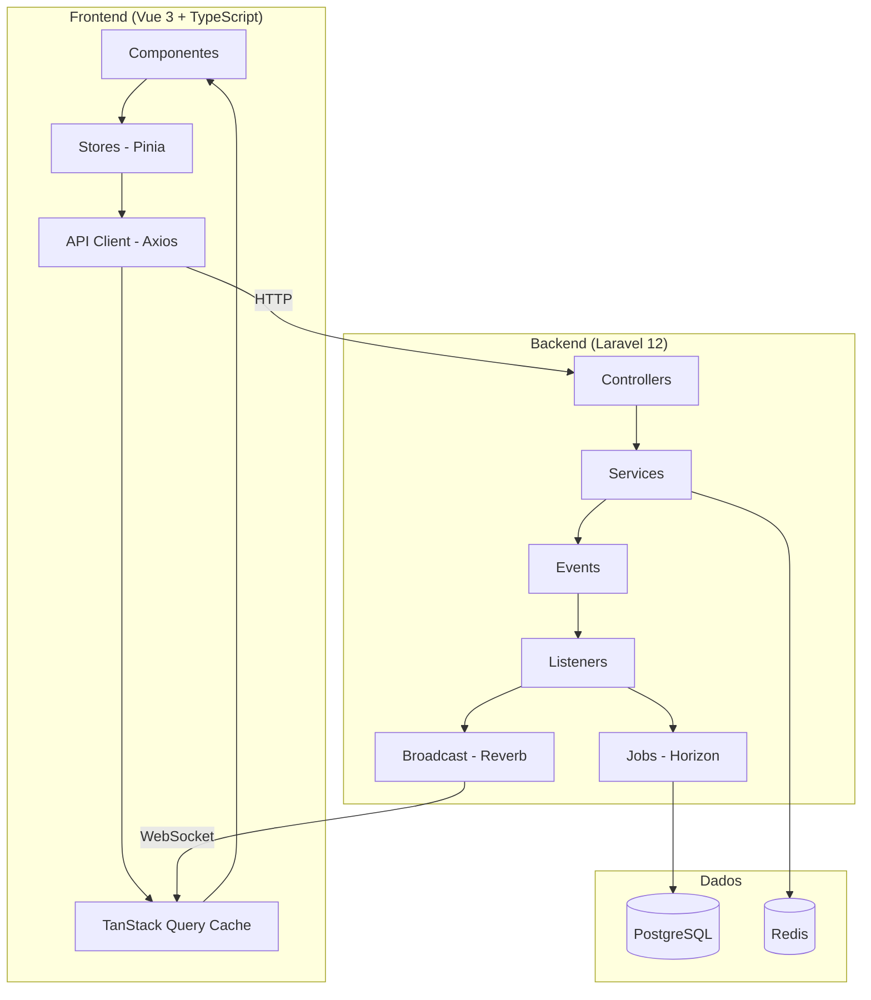

<p align="center">
  <h1 align="center">📚 StudyTrack Pro</h1>
  <p align="center">
    <em>Plataforma full-stack para desenvolvedores e estudantes acompanharem sessões de estudo e métricas de produtividade</em>
  </p>
</p>

<p align="center">
  <a href="https://github.com/hatanaca/studyStackPro/actions"></a>
  <a href="https://github.com/hatanaca/studyStackPro/actions"></a>
  <a href="https://github.com/hatanaca/studyStackPro/security"></a>
</p>

<p align="center">
  
  
  
  
  
  
</p>

<p align="center">
  <a href="#features">Features</a> •
  <a href="#arquitetura">Arquitetura</a> •
  <a href="#stack-tecnológica">Stack</a> •
  <a href="#instalação">Instalação</a> •
  <a href="#comandos">Comandos</a> •
  <a href="#documentação">Docs</a>
</p>

---

## Sobre o projeto

**StudyTrack Pro** é uma aplicação full-stack para **desenvolvedores e estudantes** registrarem sessões de estudo, visualizar métricas de produtividade e manter consistência em rotinas de aprendizado.

**Para quem:** desenvolvedores autodidatas, participantes de bootcamps e quem busca medir evolução técnica.

**Por quê:** portfólio full-stack demonstrando arquitetura event-driven, cache distribuído, TypeScript, WebSocket em tempo real e boas práticas.

---

## Features

| Feature | Descrição |
|---------|-----------|
| ⏱️ **Sessões de estudo** | Registro manual ou timer em tempo real. Vincule sessões a tecnologias. |
| 📊 **Dashboard** | KPIs (horas totais, sessões, streak), gráficos de séries temporais e distribuição por tecnologia. |
| 🔥 **Heatmap** | Visualização de atividade por dia/semana (estilo GitHub). |
| 💻 **Tecnologias** | CRUD de tecnologias (nome, cor, ícone). Busca para autocomplete. |
| 🎯 **Metas** | Defina metas de horas/semana. Persistência em localStorage. |
| 📤 **Exportação** | Exporte dados de analytics em JSON para período customizado. |
| 🌙 **Tema escuro** | Suporte a dark mode e tema customizável. |
| ⚡ **Tempo real** | Dashboard atualiza via WebSocket (Laravel Reverb) quando sessões mudam. |
| 🔐 **Autenticação** | Registro, login, tokens Sanctum. Gestão de dispositivos. |

---

## Arquitetura


```mermaid
graph TB
    subgraph Frontend["Frontend (Vue 3 + TypeScript)"]
        A[Componentes] --> B[Stores - Pinia]
        B --> C[API Client - Axios]
        C --> D[TanStack Query Cache]
    end

    subgraph Backend["Backend (Laravel 12)"]
        E[Controllers] --> F[Services]
        F --> G[Events]
        G --> H[Listeners]
        H --> I[Jobs - Horizon]
        H --> J[Broadcast - Reverb]
    end

    subgraph Data["Dados"]
        K[(PostgreSQL)]
        L[(Redis)]
    end

    C -->|HTTP| E
    I --> K
    F --> L
    J -->|WebSocket| D
    D --> A
```

### Fluxo de Métricas

1. **Sessão criada/atualizada/deletada** → Event → Listener
2. **RecalculateMetricsJob** em fila `metrics` (delay 2s para agrupar)
3. **Job**: recalcula `user_metrics`, `technology_metrics`, `daily_minutes` em transação
4. **Flush cache** analytics do usuário
5. **Event `MetricsRecalculated`** → frontend recebe via Reverb

### Schemas PostgreSQL

| Schema | Conteúdo | Uso |
|--------|----------|-----|
| `public` | users, technologies, study_sessions | Transacional (writes) |
| `analytics` | user_metrics, technology_metrics, daily_minutes | Analítico (reads) |

---

## Stack Tecnológica

<table>
<tr>
<td><strong>Frontend</strong></td>
<td><strong>Backend</strong></td>
<td><strong>Infra</strong></td>
</tr>
<tr>
<td>

- Vue 3.5 (Composition API)
- TypeScript 5.4
- Vite 6
- Pinia (estado)
- TanStack Query (cache)
- PrimeVue (UI)
- ApexCharts (gráficos)
- Axios (HTTP)
- Laravel Echo (WebSocket)

</td>
<td>

- Laravel 12
- PHP 8.2+
- Laravel Sanctum (auth)
- Laravel Reverb (WebSocket)
- Laravel Horizon (filas)
- Eloquent ORM
- Form Requests
- API Resources

</td>
<td>

- PostgreSQL 16
- Redis 7
- Docker & Compose
- OpenResty (proxy Lua)
- GitHub Actions (CI/CD)
- CodeQL (segurança)
- Dependabot (deps)

</td>
</tr>
</table>

---

## Instalação

### Pré-requisitos

- **Docker** e **Docker Compose**
- **Git**

### Setup rápido

```bash
# 1. Clone
git clone https://github.com/hatanaca/studyStackPro.git
cd studyStackPro

# 2. Configure variáveis
make setup

# 3. Suba os containers
make dev

# 4. Primeiro uso: key, migrations e seed
make shell-php
php artisan key:generate
php artisan migrate:fresh --seed
exit

# 5. Build do frontend
cd frontend && npm install && npm run build && cd ..

# 6. Acesse
# API + SPA: http://localhost
# Frontend dev: http://localhost:5173
# Health: http://localhost/api/health
# Horizon: http://localhost/horizon
```

### Ambientes

| Serviço | URL | Descrição |
|---------|-----|-----------|
| **API + SPA** | `http://localhost` | Aplicação principal |
| **Frontend Dev** | `http://localhost:5173` | Vite HMR |
| **Health API** | `http://localhost/api/health` | Status do sistema |
| **Horizon** | `http://localhost/horizon` | Dashboard de filas |
| **pgAdmin** | `http://localhost:5050` | Admin PostgreSQL (dev) |
| **Mailpit** | `http://localhost:8025` | Captura de emails (dev) |

---

## Comandos

| Comando | Descrição |
|---------|-----------|
| `make setup` | Cria arquivos `.env` (primeira vez) |
| `make dev` | Sobe todos os serviços Docker |
| `make stop` | Para os containers |
| `make shell-php` | Shell no container PHP |
| `make shell-vue` | Shell no container Node |
| `make migrate` | Roda migrations |
| `make fresh` | migrate:fresh --seed |
| `make test` | Testes backend + frontend |
| `make logs` | Logs de todos os containers |

---

## Estrutura

```
studyTrackPro/
├── backend/                 # Laravel 12 API
│   ├── app/
│   │   ├── Events/          # Eventos de domínio
│   │   ├── Jobs/            # RecalculateMetricsJob
│   │   ├── Listeners/       # Invalidar cache, broadcast
│   │   ├── Modules/         # Auth, Sessions, Technologies, Analytics
│   │   └── Http/            # Controllers, Middleware, Requests, Resources
│   ├── database/migrations/ # transactional/ + analytics/
│   └── routes/api.php       # /api/v1/*
├── frontend/                # Vue 3 SPA
│   └── src/
│       ├── api/             # Cliente HTTP e módulos
│       ├── components/      # UI components
│       ├── features/        # Módulos por domínio
│       ├── stores/          # Pinia stores
│       ├── composables/     # useToast, useWebSocket, etc.
│       └── views/           # Dashboard, Sessions, Technologies
├── docker/                  # OpenResty, PHP, Postgres, Redis
├── redis-scripts/           # Lua: dedup, sliding_window, streak
├── docs/                    # Documentação consolidada
└── Makefile
```

---

## Documentação

| Documento | Descrição |
|-----------|-----------|
| [backend/README.md](backend/README.md) | API, endpoints, rate limits, convenções |
| [frontend/README.md](frontend/README.md) | Stack, estrutura, scripts, design system |
| [docker/README.md](docker/README.md) | Serviços Docker, proxy, configuração |
| [docs/README.md](docs/README.md) | Índice de toda a documentação |
| [Postman Collection](docs/api/StudyTrack_API_Collection.postman.json) | Coleção da API v1 |

---

## Variáveis de Ambiente

- **Raiz:** `.env.example` → `.env`
- **Backend:** `backend/.env.example` → `backend/.env`
- **Frontend:** `frontend/.env.example` → `frontend/.env`

> ⚠️ Em produção: `APP_DEBUG=false`, HTTPS, senhas fortes. Ver [docs/operations/DEPLOY_SECURITY_PASSO_A_PASSO.md](docs/operations/DEPLOY_SECURITY_PASSO_A_PASSO.md).

---

## Contribuindo

1. Fork o projeto
2. Crie uma branch (`git checkout -b feature/nova-feature`)
3. Commit suas mudanças (`git commit -m 'feat: adicionar nova feature'`)
4. Push para a branch (`git push origin feature/nova-feature`)
5. Abra um Pull Request

---

## Licença

Uso educacional e portfólio.

---

<p align="center">
  Feito com ❤️ por <a href="https://github.com/hatanaca">Thiago Hatanaka</a>
</p>
