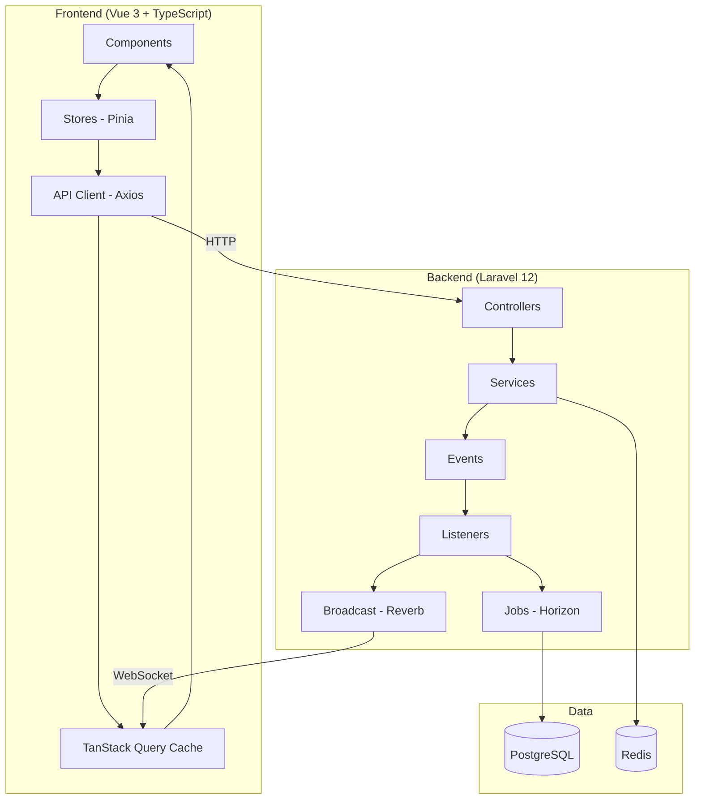

<p align="center">
  <h1 align="center">📚 StudyTrack Pro</h1>
  <p align="center">
    <em>Full-stack platform for developers and students to track study sessions and productivity metrics</em>
  </p>
</p>

<p align="center">
  <a href="https://github.com/hatanaca/studyStackPro/actions"></a>
  <a href="https://github.com/hatanaca/studyStackPro/actions"></a>
  <a href="https://github.com/hatanaca/studyStackPro/security"></a>
</p>

<p align="center">
  
  
  
  
  
  
</p>

<p align="center">
  <a href="#features">Features</a> •
  <a href="#architecture">Architecture</a> •
  <a href="#tech-stack">Stack</a> •
  <a href="#installation">Installation</a> •
  <a href="#commands">Commands</a> •
  <a href="#documentation">Docs</a>
</p>

---

## About the Project

**StudyTrack Pro** is a full-stack application for **developers and students** to log study sessions, visualize productivity metrics, and maintain consistency in learning routines.

**Target audience:** self-taught developers, bootcamp participants, and anyone looking to measure technical growth.

**Why:** full-stack portfolio demonstrating event-driven architecture, distributed cache, TypeScript, real-time WebSocket, and best practices.

---

## Features

| Feature | Description |
|---------|-------------|
| ⏱️ **Study Sessions** | Manual logging or real-time timer. Link sessions to technologies. |
| 📊 **Dashboard** | KPIs (total hours, sessions, streak), time-series charts, and technology distribution. |
| 🔥 **Heatmap** | Activity visualization by day/week (GitHub-style). |
| 💻 **Technologies** | CRUD for technologies (name, color, icon). Autocomplete search. |
| 🎯 **Goals** | Set weekly hour goals. Persistence in localStorage. |
| 📤 **Export** | Export analytics data as JSON for a custom date range. |
| 🌙 **Dark Theme** | Dark mode support and customizable theme. |
| ⚡ **Real-time** | Dashboard updates via WebSocket (Laravel Reverb) when sessions change. |
| 🔐 **Authentication** | Registration, login, Sanctum tokens. Device management. |

---

## Architecture


```mermaid
graph TB
    subgraph Frontend["Frontend (Vue 3 + TypeScript)"]
        A[Components] --> B[Stores - Pinia]
        B --> C[API Client - Axios]
        C --> D[TanStack Query Cache]
    end

    subgraph Backend["Backend (Laravel 12)"]
        E[Controllers] --> F[Services]
        F --> G[Events]
        G --> H[Listeners]
        H --> I[Jobs - Horizon]
        H --> J[Broadcast - Reverb]
    end

    subgraph Data["Data"]
        K[(PostgreSQL)]
        L[(Redis)]
    end

    C -->|HTTP| E
    I --> K
    F --> L
    J -->|WebSocket| D
    D --> A
```

### Metrics Flow

1. **Session created/updated/deleted** → Event → Listener
2. **RecalculateMetricsJob** on `metrics` queue (2s delay to batch)
3. **Job**: recalculates `user_metrics`, `technology_metrics`, `daily_minutes` in a transaction
4. **Flush** user analytics cache
5. **Event `MetricsRecalculated`** → frontend receives via Reverb

### PostgreSQL Schemas

| Schema | Content | Usage |
|--------|---------|-------|
| `public` | users, technologies, study_sessions | Transactional (writes) |
| `analytics` | user_metrics, technology_metrics, daily_minutes | Analytics (reads) |

---

## Tech Stack

<table>
<tr>
<td><strong>Frontend</strong></td>
<td><strong>Backend</strong></td>
<td><strong>Infra</strong></td>
</tr>
<tr>
<td>

- Vue 3.5 (Composition API)
- TypeScript 5.4
- Vite 6
- Pinia (state)
- TanStack Query (cache)
- PrimeVue (UI)
- ApexCharts (charts)
- Axios (HTTP)
- Laravel Echo (WebSocket)

</td>
<td>

- Laravel 12
- PHP 8.2+
- Laravel Sanctum (auth)
- Laravel Reverb (WebSocket)
- Laravel Horizon (queues)
- Eloquent ORM
- Form Requests
- API Resources

</td>
<td>

- PostgreSQL 16
- Redis 7
- Docker & Compose
- OpenResty (Lua proxy)
- GitHub Actions (CI/CD)
- CodeQL (security)
- Dependabot (deps)

</td>
</tr>
</table>

---

## Installation

### Prerequisites

- **Docker** and **Docker Compose**
- **Git**

### Quick Setup

```bash
# 1. Clone
git clone https://github.com/hatanaca/studyStackPro.git
cd studyStackPro

# 2. Configure environment variables
make setup

# 3. Start containers
make dev

# 4. First run: generate key, run migrations and seed
make shell-php
php artisan key:generate
php artisan migrate:fresh --seed
exit

# 5. Build frontend
cd frontend && npm install && npm run build && cd ..

# 6. Access
# API + SPA: http://localhost
# Frontend dev: http://localhost:5173
# Health: http://localhost/api/health
# Horizon: http://localhost/horizon
```

### Environments

| Service | URL | Description |
|---------|-----|-------------|
| **API + SPA** | `http://localhost` | Main application |
| **Frontend Dev** | `http://localhost:5173` | Vite HMR |
| **Health API** | `http://localhost/api/health` | System status |
| **Horizon** | `http://localhost/horizon` | Queue dashboard |
| **pgAdmin** | `http://localhost:5050` | PostgreSQL admin (dev) |
| **Mailpit** | `http://localhost:8025` | Email capture (dev) |

---

## Commands

| Command | Description |
|---------|-------------|
| `make setup` | Creates `.env` files (first time) |
| `make dev` | Starts all Docker services |
| `make stop` | Stops containers |
| `make shell-php` | Shell into PHP container |
| `make shell-vue` | Shell into Node container |
| `make migrate` | Runs migrations |
| `make fresh` | migrate:fresh --seed |
| `make test` | Runs backend + frontend tests |
| `make logs` | Logs from all containers |

---

## Project Structure

```
studyTrackPro/
├── backend/                 # Laravel 12 API
│   ├── app/
│   │   ├── Events/          # Domain events
│   │   ├── Jobs/            # RecalculateMetricsJob
│   │   ├── Listeners/       # Cache invalidation, broadcast
│   │   ├── Modules/         # Auth, Sessions, Technologies, Analytics
│   │   └── Http/            # Controllers, Middleware, Requests, Resources
│   ├── database/migrations/ # transactional/ + analytics/
│   └── routes/api.php       # /api/v1/*
├── frontend/                # Vue 3 SPA
│   └── src/
│       ├── api/             # HTTP client and modules
│       ├── components/      # UI components
│       ├── features/        # Domain modules
│       ├── stores/          # Pinia stores
│       ├── composables/     # useToast, useWebSocket, etc.
│       └── views/           # Dashboard, Sessions, Technologies
├── docker/                  # OpenResty, PHP, Postgres, Redis
├── redis-scripts/           # Lua: dedup, sliding_window, streak
├── docs/                    # Consolidated documentation
└── Makefile
```

---

## Documentation

| Document | Description |
|----------|-------------|
| [backend/README.md](backend/README.md) | API, endpoints, rate limits, conventions |
| [frontend/README.md](frontend/README.md) | Stack, structure, scripts, design system |
| [docker/README.md](docker/README.md) | Docker services, proxy, configuration |
| [docs/README.md](docs/README.md) | Full documentation index |
| [Postman Collection](docs/api/StudyTrack_API_Collection.postman.json) | API v1 collection |

---

## Environment Variables

- **Root:** `.env.example` → `.env`
- **Backend:** `backend/.env.example` → `backend/.env`
- **Frontend:** `frontend/.env.example` → `frontend/.env`

> ⚠️ In production: `APP_DEBUG=false`, HTTPS, strong passwords. See [docs/operations/DEPLOY_SECURITY_PASSO_A_PASSO.md](docs/operations/DEPLOY_SECURITY_PASSO_A_PASSO.md).

---

## Contributing

1. Fork the project
2. Create a branch (`git checkout -b feature/new-feature`)
3. Commit your changes (`git commit -m 'feat: add new feature'`)
4. Push to the branch (`git push origin feature/new-feature`)
5. Open a Pull Request

---

## License

Educational and portfolio use.

---

<p align="center">
  Made with ❤️ by <a href="https://github.com/hatanaca">Thiago Hatanaka</a>
</p>
