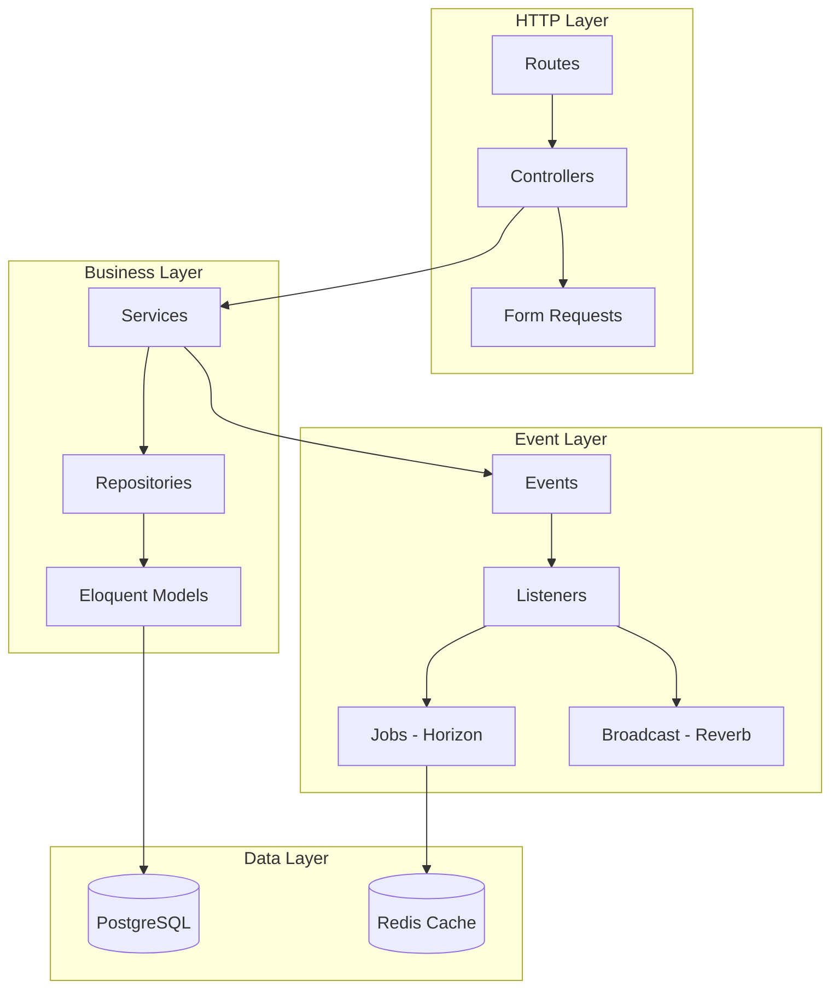

<p align="center">
  <h1 align="center">🔧 StudyTrack Pro — Backend</h1>
  <p align="center">
    <em>API REST construída com Laravel 12, PostgreSQL e Redis</em>
  </p>
</p>

<p align="center">
  
  
  
  
</p>

<p align="center">
  <a href="#stack">Stack</a> •
  <a href="#api-v1">API</a> •
  <a href="#arquitetura">Arquitetura</a> •
  <a href="#instalação">Instalação</a> •
  <a href="#testes">Testes</a>
</p>

---

## Stack

| Componente | Tecnologia | Versão |
|------------|------------|--------|
| Framework | Laravel | 12.x |
| PHP | PHP | 8.2+ |
| Banco de dados | PostgreSQL | 16 |
| Cache / Filas | Redis | 7 |
| Autenticação | Laravel Sanctum | 4.x |
| WebSocket | Laravel Reverb | 1.x |
| Filas | Laravel Horizon | 5.x |
| Análise estática | Larastan | 3.x |
| Code style | Laravel Pint | 1.x |

---

## Arquitetura



### Convenções

| Camada | Responsabilidade |
|--------|------------------|
| **Controllers** | Thin: delegam para Services, usam Form Requests e Resources |
| **Services** | Regras de negócio; acessam dados via Repositories |
| **Repositories** | Abstraem Eloquent. Implementam contratos em `Contracts/` |
| **DTOs** | `readonly` e transportam dados validados entre camadas |
| **Events** | No passado: Created, Updated, Deleted |
| **Listeners** | Rápidos: invalidam cache, disparam jobs |

---

## Estrutura

```
app/
├── Events/                 # Eventos de domínio
│   ├── StudySession/       # StudySessionCreated, Updated, Deleted
│   └── Analytics/          # MetricsRecalculated
├── Http/
│   ├── Controllers/V1/     # Auth, StudySession, Technology, Analytics
│   ├── Middleware/         # SetUserTimezone, etc.
│   ├── Requests/           # Form Requests (validação)
│   └── Resources/          # API Resources (User, StudySession, etc.)
├── Jobs/                   # RecalculateMetricsJob
├── Listeners/              # InvalidateCache, DispatchRecalculation, Broadcast
├── Models/                 # User, Technology, StudySession, BaseModel
├── Modules/                # Módulos por domínio
│   ├── Auth/               # Services, DTOs, Repositories
│   ├── StudySessions/
│   ├── Technologies/
│   └── Analytics/          # Services, Aggregators, Repositories
├── Providers/              # EventServiceProvider, AppServiceProvider
└── Traits/                 # HasApiResponse, HasUuid

database/
├── migrations/
│   ├── transactional/      # users, technologies, study_sessions, etc.
│   └── analytics/          # user_metrics, technology_metrics, daily_minutes
└── seeders/

routes/
├── api.php                 # /api/v1/* (negócio) e GET /api/health
├── web.php                 # Raiz, GET /health (mesmo HealthController)
└── channels.php            # Canal privado dashboard.{userId}
```

---

## API v1

> Todos os endpoints usam o prefixo **`/api/v1`**

### Autenticação

| Método | Endpoint | Descrição |
|--------|----------|-----------|
| <span style="color:green">POST</span> | `/api/v1/auth/register` | Registro |
| <span style="color:green">POST</span> | `/api/v1/auth/login` | Login |
| <span style="color:green">POST</span> | `/api/v1/auth/logout` | Logout |
| <span style="color:blue">GET</span> | `/api/v1/auth/me` | Usuário atual |
| <span style="color:orange">PUT</span> | `/api/v1/auth/me` | Atualizar perfil |
| <span style="color:green">POST</span> | `/api/v1/auth/change-password` | Trocar senha |
| <span style="color:blue">GET</span> | `/api/v1/auth/tokens` | Listar tokens |
| <span style="color:red">DELETE</span> | `/api/v1/auth/tokens` | Revogar todos |

### Tecnologias

| Método | Endpoint | Descrição |
|--------|----------|-----------|
| <span style="color:blue">GET</span> | `/api/v1/technologies` | Listar |
| <span style="color:blue">GET</span> | `/api/v1/technologies/search?q=` | Buscar (autocomplete) |
| <span style="color:blue">GET</span> | `/api/v1/technologies/{id}` | Detalhar |
| <span style="color:green">POST</span> | `/api/v1/technologies` | Criar |
| <span style="color:orange">PUT</span> | `/api/v1/technologies/{id}` | Atualizar |
| <span style="color:red">DELETE</span> | `/api/v1/technologies/{id}` | Desativar |

### Sessões

| Método | Endpoint | Descrição |
|--------|----------|-----------|
| <span style="color:blue">GET</span> | `/api/v1/study-sessions` | Listar (filtros, paginação) |
| <span style="color:blue">GET</span> | `/api/v1/study-sessions/active` | Sessão ativa |
| <span style="color:blue">GET</span> | `/api/v1/study-sessions/{id}` | Detalhar |
| <span style="color:green">POST</span> | `/api/v1/study-sessions` | Criar (log manual) |
| <span style="color:green">POST</span> | `/api/v1/study-sessions/start` | Iniciar sessão |
| <span style="color:orange">PATCH</span> | `/api/v1/study-sessions/{id}/end` | Encerrar sessão |
| <span style="color:orange">PUT</span> | `/api/v1/study-sessions/{id}` | Atualizar |
| <span style="color:red">DELETE</span> | `/api/v1/study-sessions/{id}` | Deletar |

### Analytics

| Método | Endpoint | Descrição |
|--------|----------|-----------|
| <span style="color:blue">GET</span> | `/api/v1/analytics/dashboard` | Payload completo |
| <span style="color:blue">GET</span> | `/api/v1/analytics/user-metrics` | Métricas do usuário |
| <span style="color:blue">GET</span> | `/api/v1/analytics/tech-stats` | Por tecnologia |
| <span style="color:blue">GET</span> | `/api/v1/analytics/time-series?days=` | Séries temporais |
| <span style="color:blue">GET</span> | `/api/v1/analytics/weekly` | Comparação semanal |
| <span style="color:blue">GET</span> | `/api/v1/analytics/heatmap?year=` | Heatmap |
| <span style="color:green">POST</span> | `/api/v1/analytics/recalculate` | Disparar recálculo |
| <span style="color:blue">GET</span> | `/api/v1/analytics/export?start=&end=` | Exportar JSON |

### Health

| Método | Endpoint | Descrição |
|--------|----------|-----------|
| <span style="color:blue">GET</span> | `/api/health` | Health JSON (DB, Redis, fila, WebSocket) |
| <span style="color:blue">GET</span> | `/health` | Mesmo controller via web |
| <span style="color:blue">GET</span> | `/up` | Health mínimo do Laravel |

---

## Rate Limiting

| Limiter | Limite | Escopo |
|---------|--------|--------|
| `login` | 3/min | por IP |
| `register` | 5/min | por IP |
| `search` | 120/min | por usuário |
| `sensitive` | 5/min | por usuário |
| `recalculate` | 2/min | por usuário |
| `export` | 30/min | por usuário |
| `health` | 300/min | por IP |
| Leitura autenticada | 60/min | por usuário |
| Escrita autenticada | 30/min | por usuário |

> Rotas de sessão usam `throttle.sliding` (janela deslizante via Redis Lua).

---

## Cache

```php
Cache::tags(['analytics', "user:{$id}"])
```

| Chave | TTL |_FLUSH |
|-------|-----|--------|
| Dashboard | 5min | por usuário |
| Heatmap | 1h | por usuário |
| Export | Sem cache | — |

---

## Instalação

### Docker (recomendado)

```bash
make dev
make shell-php
php artisan key:generate
php artisan migrate:fresh --seed
```

### Local

```bash
composer install
cp .env.example .env
php artisan key:generate
php artisan migrate:fresh --seed
php artisan reverb:start   # Terminal 2
php artisan horizon        # Terminal 3
```

---

## Testes

```bash
# Rodar todos
php artisan test

# Com cobertura
php artisan test --coverage

# PHPUnit diretamente
./vendor/bin/phpunit

# Code style
./vendor/bin/pint

# Análise estática
./vendor/bin/phpstan analyse
```

### Cobertura por Módulo

| Módulo | Testes | Cobertura |
|--------|--------|-----------|
| Auth | Feature + Unit | Alta |
| StudySessions | Feature + Unit | Alta |
| Technologies | Feature + Unit | Média |
| Analytics | Feature + Unit | Média |
| Security | Feature | Alta |

---

## Variáveis de Ambiente

| Variável | Descrição |
|----------|-----------|
| `APP_KEY` | Gerar com `php artisan key:generate` |
| `DB_*` | Conexão PostgreSQL |
| `REDIS_*` | Cache, filas, Reverb |
| `REVERB_*` | WebSocket |
| `CORS_ALLOWED_ORIGINS` | Origens do frontend (produção) |
| `HORIZON_ADMIN_EMAILS` | Emails autorizados em `/horizon` |

> Veja `backend/.env.example` para todas as variáveis.

---

<p align="center">
  <a href="../README.md">← Voltar ao README principal</a>
</p>
