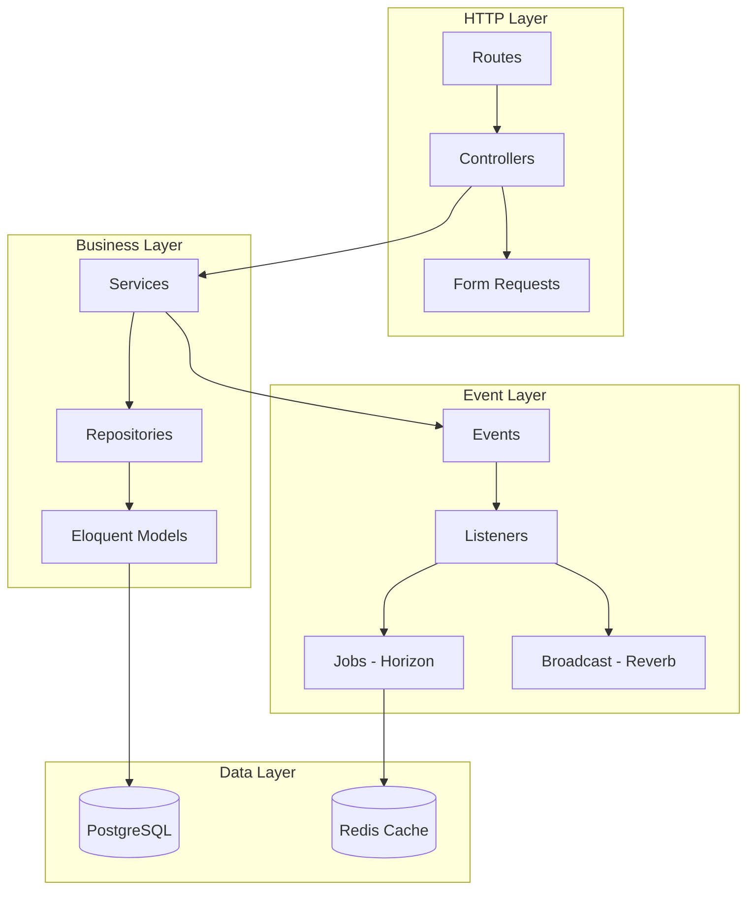

<p align="center">
  <h1 align="center">🔧 StudyTrack Pro — Backend</h1>
  <p align="center">
    <em>REST API built with Laravel 12, PostgreSQL, and Redis</em>
  </p>
</p>

<p align="center">
  
  
  
  
</p>

<p align="center">
  <a href="#stack">Stack</a> •
  <a href="#api-v1">API</a> •
  <a href="#architecture">Architecture</a> •
  <a href="#installation">Installation</a> •
  <a href="#tests">Tests</a>
</p>

---

## Stack

| Component | Technology | Version |
|-----------|------------|---------|
| Framework | Laravel | 12.x |
| PHP | PHP | 8.2+ |
| Database | PostgreSQL | 16 |
| Cache / Queues | Redis | 7 |
| Authentication | Laravel Sanctum | 4.x |
| WebSocket | Laravel Reverb | 1.x |
| Queues | Laravel Horizon | 5.x |
| Static analysis | Larastan | 3.x |
| Code style | Laravel Pint | 1.x |

---

## Architecture



### Conventions

| Layer | Responsibility |
|-------|----------------|
| **Controllers** | Thin: delegate to Services, use Form Requests and Resources |
| **Services** | Business rules; access data via Repositories |
| **Repositories** | Abstract Eloquent. Implement contracts in `Contracts/` |
| **DTOs** | `readonly` and transport validated data between layers |
| **Events** | Past tense: Created, Updated, Deleted |
| **Listeners** | Fast: invalidate cache, dispatch jobs |

---

## Structure

```
app/
├── Events/                 # Domain events
│   ├── StudySession/       # StudySessionCreated, Updated, Deleted
│   └── Analytics/          # MetricsRecalculated
├── Http/
│   ├── Controllers/V1/     # Auth, StudySession, Technology, Analytics
│   ├── Middleware/         # SetUserTimezone, etc.
│   ├── Requests/           # Form Requests (validation)
│   └── Resources/          # API Resources (User, StudySession, etc.)
├── Jobs/                   # RecalculateMetricsJob
├── Listeners/              # InvalidateCache, DispatchRecalculation, Broadcast
├── Models/                 # User, Technology, StudySession, BaseModel
├── Modules/                # Modules by domain
│   ├── Auth/               # Services, DTOs, Repositories
│   ├── StudySessions/
│   ├── Technologies/
│   └── Analytics/          # Services, Aggregators, Repositories
├── Providers/              # EventServiceProvider, AppServiceProvider
└── Traits/                 # HasApiResponse, HasUuid

database/
├── migrations/
│   ├── transactional/      # users, technologies, study_sessions, etc.
│   └── analytics/          # user_metrics, technology_metrics, daily_minutes
└── seeders/

routes/
├── api.php                 # /api/v1/* (business) and GET /api/health
├── web.php                 # Root, GET /health (same HealthController)
└── channels.php            # Private channel dashboard.{userId}
```

---

## API v1

> All endpoints use the **`/api/v1`** prefix

### Authentication

| Method | Endpoint | Description |
|--------|----------|-------------|
| <span style="color:green">POST</span> | `/api/v1/auth/register` | Registration |
| <span style="color:green">POST</span> | `/api/v1/auth/login` | Login |
| <span style="color:green">POST</span> | `/api/v1/auth/logout` | Logout |
| <span style="color:blue">GET</span> | `/api/v1/auth/me` | Current user |
| <span style="color:orange">PUT</span> | `/api/v1/auth/me` | Update profile |
| <span style="color:green">POST</span> | `/api/v1/auth/change-password` | Change password |
| <span style="color:blue">GET</span> | `/api/v1/auth/tokens` | List tokens |
| <span style="color:red">DELETE</span> | `/api/v1/auth/tokens` | Revoke all |

### Technologies

| Method | Endpoint | Description |
|--------|----------|-------------|
| <span style="color:blue">GET</span> | `/api/v1/technologies` | List |
| <span style="color:blue">GET</span> | `/api/v1/technologies/search?q=` | Search (autocomplete) |
| <span style="color:blue">GET</span> | `/api/v1/technologies/{id}` | Detail |
| <span style="color:green">POST</span> | `/api/v1/technologies` | Create |
| <span style="color:orange">PUT</span> | `/api/v1/technologies/{id}` | Update |
| <span style="color:red">DELETE</span> | `/api/v1/technologies/{id}` | Deactivate |

### Sessions

| Method | Endpoint | Description |
|--------|----------|-------------|
| <span style="color:blue">GET</span> | `/api/v1/study-sessions` | List (filters, pagination) |
| <span style="color:blue">GET</span> | `/api/v1/study-sessions/active` | Active session |
| <span style="color:blue">GET</span> | `/api/v1/study-sessions/{id}` | Detail |
| <span style="color:green">POST</span> | `/api/v1/study-sessions` | Create (manual log) |
| <span style="color:green">POST</span> | `/api/v1/study-sessions/start` | Start session |
| <span style="color:orange">PATCH</span> | `/api/v1/study-sessions/{id}/end` | End session |
| <span style="color:orange">PUT</span> | `/api/v1/study-sessions/{id}` | Update |
| <span style="color:red">DELETE</span> | `/api/v1/study-sessions/{id}` | Delete |

### Analytics

| Method | Endpoint | Description |
|--------|----------|-------------|
| <span style="color:blue">GET</span> | `/api/v1/analytics/dashboard` | Full payload |
| <span style="color:blue">GET</span> | `/api/v1/analytics/user-metrics` | User metrics |
| <span style="color:blue">GET</span> | `/api/v1/analytics/tech-stats` | By technology |
| <span style="color:blue">GET</span> | `/api/v1/analytics/time-series?days=` | Time series |
| <span style="color:blue">GET</span> | `/api/v1/analytics/weekly` | Weekly comparison |
| <span style="color:blue">GET</span> | `/api/v1/analytics/heatmap?year=` | Heatmap |
| <span style="color:green">POST</span> | `/api/v1/analytics/recalculate` | Trigger recalculation |
| <span style="color:blue">GET</span> | `/api/v1/analytics/export?start=&end=` | Export JSON |

### Health

| Method | Endpoint | Description |
|--------|----------|-------------|
| <span style="color:blue">GET</span> | `/api/health` | JSON health (DB, Redis, queue, WebSocket) |
| <span style="color:blue">GET</span> | `/health` | Same controller via web |
| <span style="color:blue">GET</span> | `/up` | Laravel minimal health |

---

## Rate Limiting

| Limiter | Limit | Scope |
|---------|-------|-------|
| `login` | 3/min | per IP |
| `register` | 5/min | per IP |
| `search` | 120/min | per user |
| `sensitive` | 5/min | per user |
| `recalculate` | 2/min | per user |
| `export` | 30/min | per user |
| `health` | 300/min | per IP |
| Authenticated reads | 60/min | per user |
| Authenticated writes | 30/min | per user |

> Session routes use `throttle.sliding` (sliding window via Redis Lua).

---

## Cache

```php
Cache::tags(['analytics', "user:{$id}"])
```

| Key | TTL | FLUSH |
|-----|-----|-------|
| Dashboard | 5min | per user |
| Heatmap | 1h | per user |
| Export | No cache | — |

---

## Installation

### Docker (recommended)

```bash
make dev
make shell-php
php artisan key:generate
php artisan migrate:fresh --seed
```

### Local

```bash
composer install
cp .env.example .env
php artisan key:generate
php artisan migrate:fresh --seed
php artisan reverb:start   # Terminal 2
php artisan horizon        # Terminal 3
```

---

## Tests

```bash
# Run all
php artisan test

# With coverage
php artisan test --coverage

# PHPUnit directly
./vendor/bin/phpunit

# Code style
./vendor/bin/pint

# Static analysis
./vendor/bin/phpstan analyse
```

### Coverage by Module

| Module | Tests | Coverage |
|--------|-------|----------|
| Auth | Feature + Unit | High |
| StudySessions | Feature + Unit | High |
| Technologies | Feature + Unit | Medium |
| Analytics | Feature + Unit | Medium |
| Security | Feature | High |

---

## Environment Variables

| Variable | Description |
|----------|-------------|
| `APP_KEY` | Generate with `php artisan key:generate` |
| `DB_*` | PostgreSQL connection |
| `REDIS_*` | Cache, queues, Reverb |
| `REVERB_*` | WebSocket |
| `CORS_ALLOWED_ORIGINS` | Frontend origins (production) |
| `HORIZON_ADMIN_EMAILS` | Authorized emails at `/horizon` |

> See `backend/.env.example` for all variables.

---

<p align="center">
  <a href="../README.md">← Back to main README</a>
</p>
