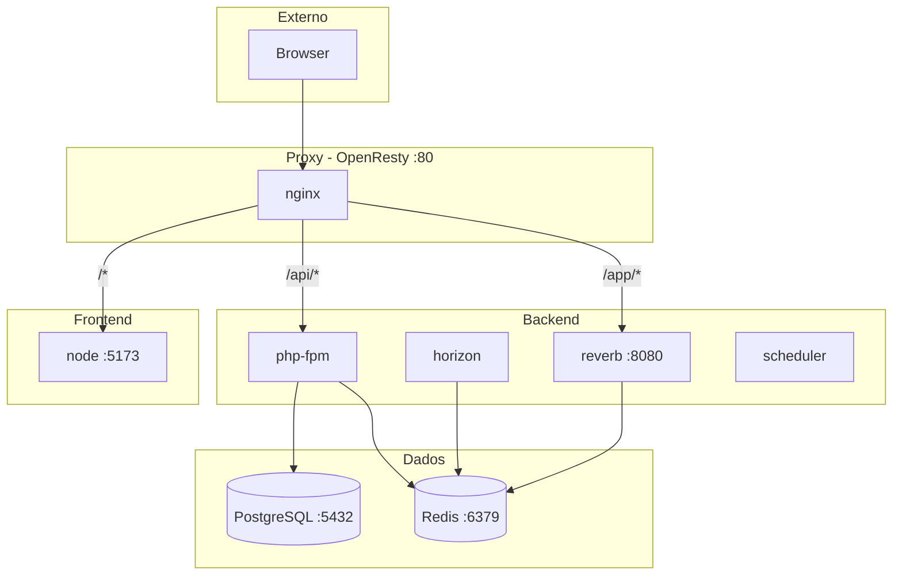

<p align="center">
  <h1 align="center">🐳 StudyTrack Pro — Docker</h1>
  <p align="center">
    <em>Infraestrutura containerizada com OpenResty, PHP-FPM, PostgreSQL e Redis</em>
  </p>
</p>

<p align="center">
  
  
  
  
</p>

<p align="center">
  <a href="#serviços">Serviços</a> •
  <a href="#arquitetura">Arquitetura</a> •
  <a href="#comandos">Comandos</a> •
  <a href="#troubleshooting">Troubleshooting</a>
</p>

---

## Serviços

### Principais (`docker-compose.yml`)

| Serviço | Imagem | Porta | Descrição |
|---------|--------|-------|-----------|
| **nginx** | OpenResty | 80, 443 | Proxy: API, SPA, WebSocket, Horizon |
| **php-fpm** | PHP 8.2-FPM | interna | Laravel API |
| **reverb** | Laravel CLI | 8080 (interna) | WebSocket server |
| **horizon** | Laravel CLI | interna | Workers de filas |
| **scheduler** | Laravel CLI | interna | `schedule:work` |
| **node** | Node.js | 5173 | Vite dev server |
| **postgres** | PostgreSQL 16 | 5432 | Banco de dados |
| **redis** | Redis 7 | 6379 | Cache e filas |

### Extras (`docker-compose.dev.yml`)

| Serviço | Porta | Descrição |
|---------|-------|-----------|
| **pgadmin** | 5050 | Interface web para PostgreSQL |
| **mailpit** | 8025 | Captura de emails (dev) |

---

## Arquitetura



---

## Rotas no Proxy

| Rota | Destino | Descrição |
|------|---------|-----------|
| `/api/*` | Laravel (php-fpm) | API REST |
| `/app/*` | Reverb (upgrade WS) | WebSocket |
| `/horizon` | Laravel | Dashboard de filas |
| `/health` | Laravel | Health check |
| `/nginx-health` | OpenResty | Probe do container |
| `/*` | SPA (frontend/dist) | Arquivos estáticos |

---

## Estrutura

```
docker/
├── nginx/
│   ├── Dockerfile              # openresty/openresty
│   ├── nginx.conf              # Configuração principal
│   └── conf.d/
│       └── studytrack.conf     # Rotas e Lua na borda
├── php/
│   ├── Dockerfile              # php-fpm
│   ├── Dockerfile.cli          # Horizon, Reverb, scheduler
│   ├── php.ini
│   └── www.conf
├── node/
│   └── Dockerfile.frontend     # Node para Vite
├── postgres/
│   ├── Dockerfile              # Postgres 16 + extensões
│   └── init/                   # Scripts SQL init
└── redis/
    ├── redis.conf
    └── docker-entrypoint.sh
```

---

## Comandos

```bash
# A partir da raiz do repositório
make dev           # docker compose up -d (dev)
make stop          # docker compose down
make build         # docker compose build
make shell-php     # Shell no container PHP
make shell-vue     # Shell no container Node
make logs          # Logs de todos os containers
make migrate       # Rodar migrations
make fresh         # migrate:fresh --seed
make test          # Testes backend + frontend
```

### Comandos Docker Diretos

```bash
# Listar containers
docker compose ps

# Logs de um serviço específico
docker compose logs -f php-fpm
docker compose logs -f nginx

# Reiniciar um serviço
docker compose restart php-fpm

# Acessar container
docker compose exec php-fpm sh
docker compose exec postgres psql -U studytrack -d studytrack
```

---

## Variáveis de Ambiente

| Variável | Serviço | Descrição |
|----------|---------|-----------|
| `DB_PASSWORD` | postgres, php-fpm | Senha do PostgreSQL |
| `POSTGRES_*` | postgres | Configuração do banco |
| `REDIS_PASSWORD` | redis, php-fpm | Senha do Redis |
| `VITE_REVERB_HOST` | node | Host do Reverb |
| `VITE_REVERB_PORT` | node | Porta do Reverb |
| `VITE_REVERB_SCHEME` | node | http ou https |

> ⚠️ No Docker, o Echo fala com Reverb **através do Nginx** (porta 80), não diretamente (8080).

---

## Troubleshooting

### Porta já em uso

```bash
# Verificar o que está usando a porta
lsof -i :80
lsof -i :5432
lsof -i :6379

# Matar o processo ou mudar a porta no docker-compose.yml
```

### Permissões de volume

```bash
# Corrigir permissões do PostgreSQL
sudo chown -R 1000:1000 docker/postgres/

# Corrigir permissões do storage
sudo chown -R 33:33 backend/storage/
```

### Container não inicia

```bash
# Verificar logs
docker compose logs php-fpm
docker compose logs nginx

# Verificar se o .env existe
ls -la backend/.env
```

### Redis connection refused

```bash
# Verificar se o Redis está rodando
docker compose ps redis

# Testar conexão
docker compose exec redis redis-cli ping
```

### PostgreSQL não aceita conexões

```bash
# Verificar status
docker compose logs postgres

# Testar conexão
docker compose exec postgres psql -U studytrack -d studytrack -c "SELECT 1"
```

---

## Produção

- Imagens e tags estáveis
- Secrets via orchestrator (não no Git)
- TLS no proxy (443)
- `APP_URL` e `REVERB_SCHEME` em HTTPS/WSS

> Ver [docs/operations/DEPLOY_SECURITY_PASSO_A_PASSO.md](../docs/operations/DEPLOY_SECURITY_PASSO_A_PASSO.md)

---

<p align="center">
  <a href="../README.md">← Voltar ao README principal</a>
</p>
