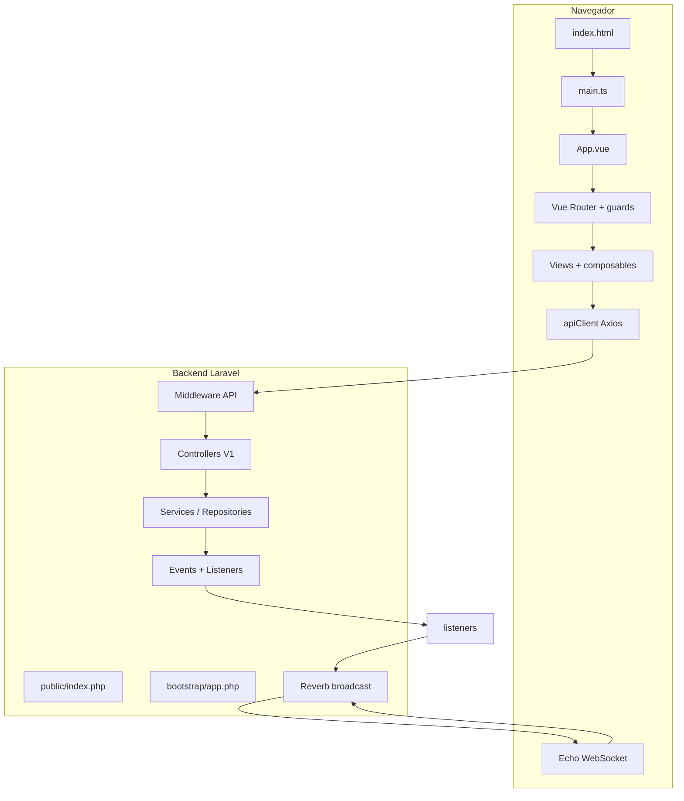

# Fluxo completo do projeto StudyTrack Pro

Documentação da **ordem de execução** nos caminhos principais: bootstrap HTTP no Laravel, middleware e rotas da API, bootstrap da SPA Vue (Pinia, Vue Query, Router, PrimeVue), guard de autenticação e interceptors Axios, ciclo de vida do layout e WebSocket (Reverb/Echo), e cadeia de eventos ao criar ou atualizar sessões de estudo até o broadcast em tempo real.

O repositório é um **monorepo** com [frontend](../../frontend/) (Vue 3 + Vite + Pinia + TanStack Query + PrimeVue + Vue Router + Laravel Echo) e [backend](../../backend/) (Laravel 11 + Sanctum + API REST `v1` + broadcasting Reverb).

---

## 1. Visão em camadas

---

## 2. Backend: de cada requisição HTTP até o controller

### 2.1 Entrada PHP

1. O servidor web aponta o document root para `[backend/public/index.php](../../backend/public/index.php)`.
2. Define `LARAVEL_START`, opcionalmente carrega **modo manutenção** (`storage/framework/maintenance.php`).
3. `require vendor/autoload.php`.
4. `(require_once bootstrap/app.php)->handleRequest(Request::capture())` — a instância retornada é `Illuminate\Foundation\Application` configurada em `[backend/bootstrap/app.php](../../backend/bootstrap/app.php)`.

### 2.2 Configuração da aplicação Laravel

Em `[backend/bootstrap/app.php](../../backend/bootstrap/app.php)`:

- `Application::configure(basePath: dirname(__DIR__))` cria a aplicação com base no diretório `backend/`.
- `withRouting(...)` registra:
  - `web`: `[routes/web.php](../../backend/routes/web.php)`
  - `api`: `[routes/api.php](../../backend/routes/api.php)` (prefixo típico `/api` do Laravel)
  - `commands`, `channels`, health `/up`
- `withMiddleware`:
  - Alias `throttle.sliding` → `SlidingWindowRateLimit`
  - Grupo **API**:
    - **prepend**: `EnsureJsonResponse` (força respostas JSON na API)
    - **append**: `SetUserTimezone`, `LogApiRequests`
- `withExceptions`: respostas JSON quando `$request->expectsJson()`.

Ordem conceitual para uma rota `api/`*: middleware global do Laravel → grupo `api` (incluindo os acima) → middleware da rota (`throttle:`*, `auth:sanctum`, etc.) → **Form Request** (se houver) → **método do Controller**.

### 2.3 Rotas da API versionadas

Em `[backend/routes/api.php](../../backend/routes/api.php)`:

- `Broadcast::routes(['middleware' => ['auth:sanctum']])` expõe `**/api/broadcasting/auth`** para o Echo assinar canais privados (o frontend usa isso em `[useWebSocket.ts](../../frontend/src/composables/useWebSocket.ts)`).
- Grupo `prefix('v1')`: URLs finais como `**/api/v1/...`**.
- **Público (throttle `login` / `register`)**: `POST auth/register`, `POST auth/login` → `[AuthController](../../backend/app/Http/Controllers/V1/AuthController.php)`.
- **Autenticado (`auth:sanctum`)**: `GET auth/me`, sessões, tecnologias, analytics, etc. — ver o arquivo para a lista completa de verbos e throttles.

### 2.4 Exemplo: login no servidor

1. `AuthController::login(LoginRequest $request)` (`[AuthController.php](../../backend/app/Http/Controllers/V1/AuthController.php)`).
2. Monta `LoginDTO` com email, senha e remember.
3. `$this->authService->login($dto)` (`[AuthService::login](../../backend/app/Modules/Auth/Services/AuthService.php)`):
  - `Auth::attempt([...])` — se falhar, retorna `null` → controller responde **401** com `HasApiResponse::error`.
  - Obtém `Auth::user()`.
  - `$this->tokenService->revokeMany($user->tokens()->get())` — política de sessão única (revoga tokens antigos).
  - `$user->createToken('api-token')->plainTextToken` — Sanctum.
4. Resposta `HasApiResponse::success` com `UserResource` + `token` + `token_type: Bearer`.

### 2.5 Exemplo: `GET /api/v1/auth/me`

1. Middleware `auth:sanctum` resolve o usuário pelo **Bearer token** no header `Authorization`.
2. `AuthController::me` → `$this->success(new UserResource($request->user()))`.

---

## 3. Frontend: bootstrap da SPA (ordem exata em `main.ts`)

Arquivo `[frontend/src/main.ts](../../frontend/src/main.ts)`:

1. **Tema inicial**: IIFE lê `localStorage['studytrack.theme']`; aplica `document.documentElement.setAttribute('data-theme', savedTheme)` antes do primeiro paint (alinha com PrimeVue Aura `darkModeSelector: '[data-theme="dark"]'`).
2. `defaultQueryRetry`: não retenta se erro for `SESSION_NOT_READY` ou HTTP 401/403; caso contrário até 2 tentativas.
3. `new QueryClient({ defaultOptions: { queries: { staleTime: 60s, refetchOnWindowFocus: false, retry } } })`.
4. `createApp(App)` → instância Vue raiz.
5. `app.use(createPinia())` — stores Pinia disponíveis (incl. `[auth.store](../../frontend/src/stores/auth.store.ts)`).
6. `app.use(VueQueryPlugin, { queryClient })` — TanStack Query.
7. `app.use(router)` — registra `router.beforeEach(setupAuthGuard)` e `afterEach` (título) definidos em `[router/index.ts](../../frontend/src/router/index.ts)`.
8. `app.use(PrimeVue, { theme: { preset: Aura, ... } })`, `ConfirmationService`, `ToastService`.
9. `app.mount('#app')` — monta `[App.vue](../../frontend/src/App.vue)`.

### 3.1 `App.vue`

Renderiza em sequência no template:

- `RouterView` (árvore de rotas).
- `Toast`, `ConfirmDialog` (PrimeVue).
- `ApiToastInit` — no `onMounted`, chama `setApiToast` em `[api/client.ts](../../frontend/src/api/client.ts)` para o interceptor de **429** poder exibir toast.

---

## 4. Roteamento e guard de autenticação (ordem de execução)

### 4.1 Definição de rotas

`[frontend/src/router/index.ts](../../frontend/src/router/index.ts)`:

- Rotas públicas: import de `[auth.routes.ts](../../frontend/src/router/routes/auth.routes.ts)` (login/registro, `meta.guest`).
- Rota pai `path: '/'` com `component: () => import('@/components/layout/AppLayout.vue')` e `meta: { requiresAuth: true }`, filhos: dashboard, sessions, technologies, goals, export, settings, reports, help, profile.

### 4.2 `beforeEach`: `setupAuthGuard`

`[frontend/src/router/guards.ts](../../frontend/src/router/guards.ts)` — fluxo lógico:

1. `useAuthStore()` (Pinia já iniciado no `main.ts`).
2. Se `to.meta.requiresAuth && !authStore.isAuthenticated` (`isAuthenticated` = `!!token`): `next({ name: 'login' })` e retorna.
3. Se há `token` mas `!sessionValidated`:
  - `awaitSessionValidation`: deduplica com `fetchMePromise` — só uma `authStore.fetchMe()` por vez.
  - `fetchMe` (`[auth.store.ts](../../frontend/src/stores/auth.store.ts)`): `authApi.me()` → Axios → `GET .../auth/me`; sucesso atualiza `user`, `localStorage`, `sessionValidated = true`.
  - Se após isso `!isAuthenticated` (token limpo por 401): rota protegida → login; senão `next()`.
4. Se `to.meta.guest && authStore.isAuthenticated`: `next({ name: 'dashboard' })`.
5. Caso contrário `next()`.

### 4.3 `afterEach`

Atualiza `document.title` com `meta.title` + sufixo "StudyTrack Pro".

### 4.4 Prefetch (opcional, UX)

`[frontend/src/router/prefetch.ts](../../frontend/src/router/prefetch.ts)` exporta funções que fazem `import()` dinâmico das views — tipicamente chamadas no **hover** da sidebar para aquecer chunks antes do clique (não faz parte do núcleo de auth).

---

## 5. Cliente HTTP Axios: interceptors e ordem relativa ao guard

`[frontend/src/api/client.ts](../../frontend/src/api/client.ts)`:

- `apiClient = axios.create({ baseURL: (VITE_API_URL || '') + '/api/v1', ... })`.

**Request interceptor** (roda antes de cada request):

1. Lê `useAuthStore()`.
2. Se `token && !sessionValidated` e a URL **não** for exceção (`GET .../auth/me` ou logout): `Promise.reject(new Error(SESSION_NOT_READY))` — evita rajadas 401 antes do `fetchMe`.
3. Se há token: `config.headers.Authorization = 'Bearer ' + token`.

**Response interceptor**:

- Propaga respostas OK.
- Erros `SESSION_NOT_READY`: rejeita sem logout.
- **401**: se não for login/register/logout e não estiver em `handlingUnauthorized`, chama `useAuthStore().clearSessionLocally()` (remove token/user, `sessionValidated = false`, `$reset` em sessions store, remove listener `online`), depois `router.push({ name: 'login' })` se necessário.
- **429**: usa `toastFn` se registrada por `ApiToastInit`.

**Módulos API** (ex.: `[auth.api.ts](../../frontend/src/api/modules/auth.api.ts)`) apenas delegam para `apiClient` + `[ENDPOINTS](../../frontend/src/api/endpoints.ts)`.

---

## 6. TanStack Query e “sessão validada”

`[frontend/src/composables/useQueryAuthEnabled.ts](../../frontend/src/composables/useQueryAuthEnabled.ts)` — `useQuerySessionEnabled`: retorna computed `authStore.sessionValidated && (condição extra)`.

Exemplo `[useDashboardQuery.ts](../../frontend/src/features/dashboard/composables/useDashboardQuery.ts)`:

- `useQuery` com `queryFn` → `analyticsApi.getDashboard()` → parse `parseDashboardResponse`.
- `enabled` amarrado à sessão validada — a query **não dispara** até o guard/`fetchMe` confirmar o JWT.
- `watch` em `query.data` → `analyticsStore.setDashboard(data)` (store como fonte para gráficos/computeds).

---

## 7. Layout autenticado: `AppLayout.vue` (ciclo de vida)

`[frontend/src/components/layout/AppLayout.vue](../../frontend/src/components/layout/AppLayout.vue)`:

`**onMounted`**:

1. `document.documentElement.setAttribute('data-theme', uiStore.theme)` e `uiStore.applyCustomTheme()`.
2. `tryConnectWebSocket()`: só se `authStore.sessionValidated && authStore.user?.id` → `connectWebSocket(authStore.user.id)`.

**Watchers**:

- `[sessionValidated, user?.id]` → reconecta WebSocket quando usuário/sessão mudam.
- `sessionValidated` → se false, `disconnectWebSocket()`.
- `route.path` → reset de scroll no container principal.
- `uiStore.theme` → atualiza `data-theme`, tema custom, invalida cache de gráficos/medidas de texto.

`**onUnmounted`**: `disconnectWebSocket()`.

Template: **sidebar**, **banner de sessão ativa** (exceto rota `session-focus`), `RouterView` filho.

---

## 8. WebSocket (Laravel Echo + Reverb)

`[frontend/src/composables/useWebSocket.ts](../../frontend/src/composables/useWebSocket.ts)`:

1. Retorno imediato se `VITE_REVERB_ENABLED === 'false'`, sem `window`, ou `!authStore.sessionValidated`.
2. `disconnectWebSocket()` antes de nova conexão.
3. Dynamic import `laravel-echo` e `pusher-js`; `window.Pusher = Pusher`.
4. Instancia `Echo` com `broadcaster: 'reverb'`, host/porta/scheme das env, `authEndpoint: ${VITE_API_URL}/api/broadcasting/auth`, header `Authorization: Bearer ${token}`.
5. `echo.private('dashboard.${userId}')` — autorização em `[backend/routes/channels.php](../../backend/routes/channels.php)`: `Broadcast::channel('dashboard.{userId}', fn ($user, $userId) => (string) $user->id === (string) $userId)`.
6. `.listen('.metrics.updated', ...)` → atualiza `analyticsStore`, invalida `queryKeys.analytics.dashboard()`.
7. `.listen('.metrics.recalculating', ...)` → spinner + fallback timer.
8. `.listen('.session.started', ...)` → monta payload e `sessionsStore.setActiveSession`.
9. `.listen('.session.ended', ...)` → `sessionsStore.clearActiveSession()`.

---

## 9. Domínio “sessão de estudo”: fluxo API → serviço → eventos → broadcast

### 9.1 HTTP → controller → service

Ex.: `POST /api/v1/study-sessions/start` (`[StudySessionController::start](../../backend/app/Http/Controllers/V1/StudySessionController.php)`):

1. Validação `StartStudySessionRequest`.
2. Se já existe ativa: `ConcurrentSessionException`.
3. Resolve `technology_id` ou primeira tecnologia do usuário.
4. Monta `StudySessionDTO` com `startedAt: now()`, etc.
5. `$this->studySessionService->create($user->id, $dto)`.

### 9.2 `StudySessionService::create`

`[StudySessionService.php](../../backend/app/Modules/StudySessions/Services/StudySessionService.php)`:

1. `$this->repository->create($dto)` persiste o modelo.
2. `event(new StudySessionCreated($session))` — ponto de integração com analytics e tempo real.

### 9.3 Listeners registrados (ordem em `EventServiceProvider`)

`[backend/app/Providers/EventServiceProvider.php](../../backend/app/Providers/EventServiceProvider.php)` para `StudySessionCreated`:

1. `InvalidateSessionCache` — limpa caches relacionados a listagens/sessão ativa.
2. `DispatchMetricsRecalculation` — enfileira/trigger recálculo de métricas (assíncrono conforme implementação).
3. `BroadcastSessionStarted` — se `ended_at === null`, dispara `event(new SessionStarted($event->session))` (`[BroadcastSessionStarted.php](../../backend/app/Listeners/StudySession/BroadcastSessionStarted.php)`).
4. `BroadcastMetricsRecalculating` — emite evento de UI “recalculando”.

O evento `SessionStarted` (`[SessionStarted.php](../../backend/app/Events/StudySession/SessionStarted.php)`) implementa `ShouldBroadcast`: canal `private dashboard.{user_id}`, nome `.session.started`, payload com sessão + tecnologia + `elapsed_seconds`.

`StudySessionUpdated` / `StudySessionDeleted` disparam outro conjunto (invalidação, recálculo, `BroadcastSessionEnded`, etc.) — mesmo padrão: service chama `event(...)` → listeners → jobs/broadcast.

### 9.4 Quando o recálculo termina

`MetricsRecalculated` → `UpdateCacheWithFreshData` + `BroadcastMetricsUpdate` (listener emite/atualiza métricas que o frontend recebe como `.metrics.updated`).

---

## 10. Store de sessões no frontend (alinhamento com API e WS)

`[frontend/src/stores/sessions.store.ts](../../frontend/src/stores/sessions.store.ts)`:

- `fetchActiveSession` → `sessionsApi.getActive()` (alinha com `StudySessionController::active` que calcula `elapsed_seconds` com `diffInSeconds`).
- `setActiveSession` / `clearActiveSession` — usados pelo WebSocket e pela UI (banner, timer).
- `$reset` chamado em `clearSessionLocally` no logout/401.

---

## 11. Resumo da ordem em um “cold start” com token salvo

1. `index.html` carrega o bundle → `main.ts` configura tema, Pinia, Vue Query, Router, PrimeVue, `mount(App)`.
2. `App.vue` monta `RouterView`; `setupAuthGuard` corre no primeiro destino.
3. Store já tem `token` do `localStorage`, `sessionValidated === false`.
4. Guard chama `fetchMe` (deduplicado); request interceptor **permite** `GET /auth/me`.
5. Sucesso → `sessionValidated = true`.
6. Queries com `useQuerySessionEnabled` passam a `enabled: true` → ex.: dashboard busca analytics.
7. `AppLayout` monta → `connectWebSocket` assina `dashboard.{userId}`.
8. Interações (iniciar sessão) → API → `StudySessionService::create` → `StudySessionCreated` → listeners → Reverb → Echo atualiza stores e invalida queries.

---

## Arquivos de referência rápida

| Área                 | Arquivo principal                                                                                                                                                                                                                                                               |
| -------------------- | ------------------------------------------------------------------------------------------------------------------------------------------------------------------------------------------------------------------------------------------------------------------------------- |
| Entrada HTTP Laravel | `[backend/public/index.php](../../backend/public/index.php)`, `[backend/bootstrap/app.php](../../backend/bootstrap/app.php)`                                                                                                                                                    |
| Rotas API            | `[backend/routes/api.php](../../backend/routes/api.php)`                                                                                                                                                                                                                        |
| Auth API + Sanctum   | `[AuthController](../../backend/app/Http/Controllers/V1/AuthController.php)`, `[AuthService](../../backend/app/Modules/Auth/Services/AuthService.php)`                                                                                                                          |
| Sessões + eventos    | `[StudySessionController](../../backend/app/Http/Controllers/V1/StudySessionController.php)`, `[StudySessionService](../../backend/app/Modules/StudySessions/Services/StudySessionService.php)`, `[EventServiceProvider](../../backend/app/Providers/EventServiceProvider.php)` |
| Bootstrap Vue        | `[frontend/src/main.ts](../../frontend/src/main.ts)`, `[App.vue](../../frontend/src/App.vue)`                                                                                                                                                                                   |
| Router + guard       | `[router/index.ts](../../frontend/src/router/index.ts)`, `[guards.ts](../../frontend/src/router/guards.ts)`                                                                                                                                                                     |
| HTTP + auth UX       | `[api/client.ts](../../frontend/src/api/client.ts)`, `[auth.store.ts](../../frontend/src/stores/auth.store.ts)`                                                                                                                                                                 |
| WebSocket            | `[useWebSocket.ts](../../frontend/src/composables/useWebSocket.ts)`, `[channels.php](../../backend/routes/channels.php)`                                                                                                                                                        |

**Nota:** alguns trechos no backend (por exemplo `StudySessionController` e `AuthService`) podem conter blocos de log em arquivo para debug; não alteram a arquitetura acima, apenas gravam artefatos em disco durante certas requisições.

---

## Ver também

- [DOCUMENTACAO_TECNICA.md](DOCUMENTACAO_TECNICA.md) — visão geral complementar do stack e dos fluxos.

