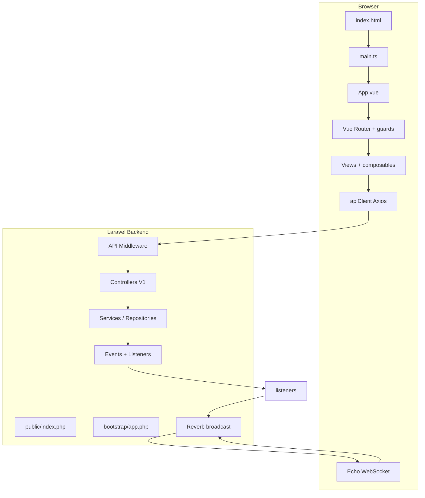

# StudyTrack Pro Complete Flow

Documentation of the **execution order** in the main paths: HTTP bootstrap in Laravel, API middleware and routes, Vue SPA bootstrap (Pinia, Vue Query, Router, PrimeVue), authentication guard and Axios interceptors, layout lifecycle and WebSocket (Reverb/Echo), and the event chain from creating or updating study sessions to real-time broadcast.

The repository is a **monorepo** with [frontend](../../frontend/) (Vue 3 + Vite + Pinia + TanStack Query + PrimeVue + Vue Router + Laravel Echo) and [backend](../../backend/) (Laravel 11 + Sanctum + REST API `v1` + Reverb broadcasting).

---

## 1. Layered View

```mermaid
flowchart TB
  subgraph browser [Browser]
    indexHtml[index.html]
    mainTs[main.ts]
    appVue[App.vue]
    router[Vue Router + guards]
    views[Views + composables]
    axios[apiClient Axios]
    echo[Echo WebSocket]
  end
  subgraph laravel [Laravel Backend]
    indexPhp[public/index.php]
    appBootstrap[bootstrap/app.php]
    pipeline[API Middleware]
    controllers[Controllers V1]
    services[Services / Repositories]
    events[Events + Listeners]
    reverb[Reverb broadcast]
  end
  indexHtml --> mainTs --> appVue --> router --> views
  views --> axios --> pipeline --> controllers --> services
  services --> events --> listeners --> reverb
  echo --> reverb
  reverb --> echo
```

---

## 2. Backend: From Each HTTP Request to the Controller

### 2.1 PHP Entry

1. The web server points the document root to `[backend/public/index.php](../../backend/public/index.php)`.
2. Defines `LARAVEL_START`, optionally loads **maintenance mode** (`storage/framework/maintenance.php`).
3. `require vendor/autoload.php`.
4. `(require_once bootstrap/app.php)->handleRequest(Request::capture())` — the returned instance is `Illuminate\Foundation\Application` configured in `[backend/bootstrap/app.php](../../backend/bootstrap/app.php)`.

### 2.2 Laravel Application Configuration

In `[backend/bootstrap/app.php](../../backend/bootstrap/app.php)`:

- `Application::configure(basePath: dirname(__DIR__))` creates the application based on the `backend/` directory.
- `withRouting(...)` registers:
  - `web`: `[routes/web.php](../../backend/routes/web.php)`
  - `api`: `[routes/api.php](../../backend/routes/api.php)` (Laravel's typical `/api` prefix)
  - `commands`, `channels`, health `/up`
- `withMiddleware`:
  - Alias `throttle.sliding` → `SlidingWindowRateLimit`
  - **API** group:
    - **prepend**: `EnsureJsonResponse` (forces JSON responses in API)
    - **append**: `SetUserTimezone`, `LogApiRequests`
- `withExceptions`: JSON responses when `$request->expectsJson()`.

Conceptual order for an `api/` route: Laravel global middleware → `api` group (including the above) → route middleware (`throttle:*`, `auth:sanctum`, etc.) → **Form Request** (if any) → **Controller method**.

### 2.3 Versioned API Routes

In `[backend/routes/api.php](../../backend/routes/api.php)`:

- `Broadcast::routes(['middleware' => ['auth:sanctum']])` exposes **`/api/broadcasting/auth`** for Echo to subscribe to private channels (the frontend uses this in `[useWebSocket.ts](../../frontend/src/composables/useWebSocket.ts)`).
- `prefix('v1')` group: final URLs like **`/api/v1/...`**.
- **Public (throttled `login` / `register`)**: `POST auth/register`, `POST auth/login` → `[AuthController](../../backend/app/Http/Controllers/V1/AuthController.php)`.
- **Authenticated (`auth:sanctum`)**: `GET auth/me`, sessions, technologies, analytics, etc. — see the file for the complete list of verbs and throttles.

### 2.4 Example: Server Login

1. `AuthController::login(LoginRequest $request)` (`[AuthController.php](../../backend/app/Http/Controllers/V1/AuthController.php)`).
2. Builds `LoginDTO` with email, password, and remember.
3. `$this->authService->login($dto)` (`[AuthService::login](../../backend/app/Modules/Auth/Services/AuthService.php)`):
   - `Auth::attempt([...])` — if it fails, returns `null` → controller responds **401** with `HasApiResponse::error`.
   - Gets `Auth::user()`.
   - `$this->tokenService->revokeMany($user->tokens()->get())` — single session policy (revokes old tokens).
   - `$user->createToken('api-token')->plainTextToken` — Sanctum.
4. Response `HasApiResponse::success` with `UserResource` + `token` + `token_type: Bearer`.

### 2.5 Example: `GET /api/v1/auth/me`

1. `auth:sanctum` middleware resolves the user by **Bearer token** in the `Authorization` header.
2. `AuthController::me` → `$this->success(new UserResource($request->user()))`.

---

## 3. Frontend: SPA Bootstrap (Exact Order in `main.ts`)

File `[frontend/src/main.ts](../../frontend/src/main.ts)`:

1. **Initial theme**: IIFE reads `localStorage['studytrack.theme']`; applies `document.documentElement.setAttribute('data-theme', savedTheme)` before first paint (aligned with PrimeVue Aura `darkModeSelector: '[data-theme="dark"]'`).
2. `defaultQueryRetry`: no retry if error is `SESSION_NOT_READY` or HTTP 401/403; otherwise up to 2 attempts.
3. `new QueryClient({ defaultOptions: { queries: { staleTime: 60s, refetchOnWindowFocus: false, retry } } })`.
4. `createApp(App)` → root Vue instance.
5. `app.use(createPinia())` — Pinia stores available (incl. `[auth.store](../../frontend/src/stores/auth.store.ts)`).
6. `app.use(VueQueryPlugin, { queryClient })` — TanStack Query.
7. `app.use(router)` — registers `router.beforeEach(setupAuthGuard)` and `afterEach` (title) defined in `[router/index.ts](../../frontend/src/router/index.ts)`.
8. `app.use(PrimeVue, { theme: { preset: Aura, ... } })`, `ConfirmationService`, `ToastService`.
9. `app.mount('#app')` — mounts `[App.vue](../../frontend/src/App.vue)`.

### 3.1 `App.vue`

Renders in sequence in the template:

- `RouterView` (route tree).
- `Toast`, `ConfirmDialog` (PrimeVue).
- `ApiToastInit` — on `onMounted`, calls `setApiToast` in `[api/client.ts](../../frontend/src/api/client.ts)` so the **429** interceptor can display a toast.

---

## 4. Routing and Authentication Guard (Execution Order)

### 4.1 Route Definition

`[frontend/src/router/index.ts](../../frontend/src/router/index.ts)`:

- Public routes: import from `[auth.routes.ts](../../frontend/src/router/routes/auth.routes.ts)` (login/register, `meta.guest`).
- Parent route `path: '/'` with `component: () => import('@/components/layout/AppLayout.vue')` and `meta: { requiresAuth: true }`, children: dashboard, sessions, technologies, goals, export, settings, reports, help, profile.

### 4.2 `beforeEach`: `setupAuthGuard`

`[frontend/src/router/guards.ts](../../frontend/src/router/guards.ts)` — logical flow:

1. `useAuthStore()` (Pinia already started in `main.ts`).
2. If `to.meta.requiresAuth && !authStore.isAuthenticated` (`isAuthenticated` = `!!token`): `next({ name: 'login' })` and return.
3. If there is a `token` but `!sessionValidated`:
   - `awaitSessionValidation`: deduplicates with `fetchMePromise` — only one `authStore.fetchMe()` at a time.
   - `fetchMe` (`[auth.store.ts](../../frontend/src/stores/auth.store.ts)`): `authApi.me()` → Axios → `GET .../auth/me`; success updates `user`, `localStorage`, `sessionValidated = true`.
   - If after that `!isAuthenticated` (token cleared by 401): protected route → login; otherwise `next()`.
4. If `to.meta.guest && authStore.isAuthenticated`: `next({ name: 'dashboard' })`.
5. Otherwise `next()`.

### 4.3 `afterEach`

Updates `document.title` with `meta.title` + "StudyTrack Pro" suffix.

### 4.4 Prefetch (Optional, UX)

`[frontend/src/router/prefetch.ts](../../frontend/src/router/prefetch.ts)` exports functions that do dynamic `import()` of views — typically called on sidebar **hover** to warm chunks before click (not part of the auth core).

---

## 5. Axios HTTP Client: Interceptors and Order Relative to Guard

`[frontend/src/api/client.ts](../../frontend/src/api/client.ts)`:

- `apiClient = axios.create({ baseURL: (VITE_API_URL || '') + '/api/v1', ... })`.

**Request interceptor** (runs before each request):

1. Reads `useAuthStore()`.
2. If `token && !sessionValidated` and the URL is **not** an exception (`GET .../auth/me` or logout): `Promise.reject(new Error(SESSION_NOT_READY))` — prevents 401 bursts before `fetchMe`.
3. If there is a token: `config.headers.Authorization = 'Bearer ' + token`.

**Response interceptor**:

- Propagates OK responses.
- `SESSION_NOT_READY` errors: rejects without logout.
- **401**: if not login/register/logout and not in `handlingUnauthorized`, calls `useAuthStore().clearSessionLocally()` (removes token/user, `sessionValidated = false`, `$reset` in sessions store, removes `online` listener), then `router.push({ name: 'login' })` if needed.
- **429**: uses `toastFn` if registered by `ApiToastInit`.

**API modules** (e.g., `[auth.api.ts](../../frontend/src/api/modules/auth.api.ts)`) only delegate to `apiClient` + `[ENDPOINTS](../../frontend/src/api/endpoints.ts)`.

---

## 6. TanStack Query and "Validated Session"

`[frontend/src/composables/useQueryAuthEnabled.ts](../../frontend/src/composables/useQueryAuthEnabled.ts)` — `useQuerySessionEnabled`: returns computed `authStore.sessionValidated && (extra condition)`.

Example `[useDashboardQuery.ts](../../frontend/src/features/dashboard/composables/useDashboardQuery.ts)`:

- `useQuery` with `queryFn` → `analyticsApi.getDashboard()` → `parseDashboardResponse` parse.
- `enabled` tied to validated session — the query **doesn't fire** until the guard/`fetchMe` confirms the JWT.
- `watch` on `query.data` → `analyticsStore.setDashboard(data)` (store as source for charts/computeds).

---

## 7. Authenticated Layout: `AppLayout.vue` (Lifecycle)

`[frontend/src/components/layout/AppLayout.vue](../../frontend/src/components/layout/AppLayout.vue)`:

**`onMounted`**:

1. `document.documentElement.setAttribute('data-theme', uiStore.theme)` and `uiStore.applyCustomTheme()`.
2. `tryConnectWebSocket()`: only if `authStore.sessionValidated && authStore.user?.id` → `connectWebSocket(authStore.user.id)`.

**Watchers**:

- `[sessionValidated, user?.id]` → reconnects WebSocket when user/session changes.
- `sessionValidated` → if false, `disconnectWebSocket()`.
- `route.path` → resets scroll on main container.
- `uiStore.theme` → updates `data-theme`, custom theme, invalidates chart/text measure cache.

**`onUnmounted`**: `disconnectWebSocket()`.

Template: **sidebar**, **active session banner** (except `session-focus` route), child `RouterView`.

---

## 8. WebSocket (Laravel Echo + Reverb)

`[frontend/src/composables/useWebSocket.ts](../../frontend/src/composables/useWebSocket.ts)`:

1. Immediate return if `VITE_REVERB_ENABLED === 'false'`, no `window`, or `!authStore.sessionValidated`.
2. `disconnectWebSocket()` before new connection.
3. Dynamic import `laravel-echo` and `pusher-js`; `window.Pusher = Pusher`.
4. Instantiates `Echo` with `broadcaster: 'reverb'`, host/port/scheme from env, `authEndpoint: ${VITE_API_URL}/api/broadcasting/auth`, header `Authorization: Bearer ${token}`.
5. `echo.private('dashboard.${userId}')` — authorization in `[backend/routes/channels.php](../../backend/routes/channels.php)`: `Broadcast::channel('dashboard.{userId}', fn ($user, $userId) => (string) $user->id === (string) $userId)`.
6. `.listen('.metrics.updated', ...)` → updates `analyticsStore`, invalidates `queryKeys.analytics.dashboard()`.
7. `.listen('.metrics.recalculating', ...)` → spinner + fallback timer.
8. `.listen('.session.started', ...)` → builds payload and `sessionsStore.setActiveSession`.
9. `.listen('.session.ended', ...)` → `sessionsStore.clearActiveSession()`.

---

## 9. "Study Session" Domain: API → Service → Events → Broadcast

### 9.1 HTTP → Controller → Service

E.g., `POST /api/v1/study-sessions/start` (`[StudySessionController::start](../../backend/app/Http/Controllers/V1/StudySessionController.php)`):

1. `StartStudySessionRequest` validation.
2. If one is already active: `ConcurrentSessionException`.
3. Resolves `technology_id` or the user's first technology.
4. Builds `StudySessionDTO` with `startedAt: now()`, etc.
5. `$this->studySessionService->create($user->id, $dto)`.

### 9.2 `StudySessionService::create`

`[StudySessionService.php](../../backend/app/Modules/StudySessions/Services/StudySessionService.php)`:

1. `$this->repository->create($dto)` persists the model.
2. `event(new StudySessionCreated($session))` — integration point with analytics and real-time.

### 9.3 Registered Listeners (Order in `EventServiceProvider`)

`[backend/app/Providers/EventServiceProvider.php](../../backend/app/Providers/EventServiceProvider.php)` for `StudySessionCreated`:

1. `InvalidateSessionCache` — clears caches related to listings/active session.
2. `DispatchMetricsRecalculation` — queues/triggers metrics recalculation (asynchronous per implementation).
3. `BroadcastSessionStarted` — if `ended_at === null`, dispatches `event(new SessionStarted($event->session))` (`[BroadcastSessionStarted.php](../../backend/app/Listeners/StudySession/BroadcastSessionStarted.php)`).
4. `BroadcastMetricsRecalculating` — emits UI "recalculating" event.

The `SessionStarted` event (`[SessionStarted.php](../../backend/app/Events/StudySession/SessionStarted.php)`) implements `ShouldBroadcast`: channel `private dashboard.{user_id}`, name `.session.started`, payload with session + technology + `elapsed_seconds`.

`StudySessionUpdated` / `StudySessionDeleted` dispatch another set (invalidation, recalculation, `BroadcastSessionEnded`, etc.) — same pattern: service calls `event(...)` → listeners → jobs/broadcast.

### 9.4 When Recalculation Completes

`MetricsRecalculated` → `UpdateCacheWithFreshData` + `BroadcastMetricsUpdate` (listener emits/updates metrics that the frontend receives as `.metrics.updated`).

---

## 10. Session Store in Frontend (Alignment with API and WS)

`[frontend/src/stores/sessions.store.ts](../../frontend/src/stores/sessions.store.ts)`:

- `fetchActiveSession` → `sessionsApi.getActive()` (aligned with `StudySessionController::active` which calculates `elapsed_seconds` with `diffInSeconds`).
- `setActiveSession` / `clearActiveSession` — used by WebSocket and UI (banner, timer).
- `$reset` called in `clearSessionLocally` on logout/401.

---

## 11. Cold Start Order with Saved Token

1. `index.html` loads the bundle → `main.ts` configures theme, Pinia, Vue Query, Router, PrimeVue, `mount(App)`.
2. `App.vue` mounts `RouterView`; `setupAuthGuard` runs on first destination.
3. Store already has `token` from `localStorage`, `sessionValidated === false`.
4. Guard calls `fetchMe` (deduplicated); request interceptor **allows** `GET /auth/me`.
5. Success → `sessionValidated = true`.
6. Queries with `useQuerySessionEnabled` become `enabled: true` → e.g., dashboard fetches analytics.
7. `AppLayout` mounts → `connectWebSocket` subscribes to `dashboard.{userId}`.
8. Interactions (start session) → API → `StudySessionService::create` → `StudySessionCreated` → listeners → Reverb → Echo updates stores and invalidates queries.

---

## Quick Reference Files

| Area | Main File |
|------|-----------|
| Laravel HTTP Entry | `[backend/public/index.php](../../backend/public/index.php)`, `[backend/bootstrap/app.php](../../backend/bootstrap/app.php)` |
| API Routes | `[backend/routes/api.php](../../backend/routes/api.php)` |
| Auth API + Sanctum | `[AuthController](../../backend/app/Http/Controllers/V1/AuthController.php)`, `[AuthService](../../backend/app/Modules/Auth/Services/AuthService.php)` |
| Sessions + Events | `[StudySessionController](../../backend/app/Http/Controllers/V1/StudySessionController.php)`, `[StudySessionService](../../backend/app/Modules/StudySessions/Services/StudySessionService.php)`, `[EventServiceProvider](../../backend/app/Providers/EventServiceProvider.php)` |
| Vue Bootstrap | `[frontend/src/main.ts](../../frontend/src/main.ts)`, `[App.vue](../../frontend/src/App.vue)` |
| Router + Guard | `[router/index.ts](../../frontend/src/router/index.ts)`, `[guards.ts](../../frontend/src/router/guards.ts)` |
| HTTP + Auth UX | `[api/client.ts](../../frontend/src/api/client.ts)`, `[auth.store.ts](../../frontend/src/stores/auth.store.ts)` |
| WebSocket | `[useWebSocket.ts](../../frontend/src/composables/useWebSocket.ts)`, `[channels.php](../../backend/routes/channels.php)` |

**Note:** Some backend sections (e.g., `StudySessionController` and `AuthService`) may contain file log blocks for debugging; they do not change the architecture above, they only write artifacts to disk during certain requests.

---

## See Also

- [DOCUMENTACAO_TECNICA.md](DOCUMENTACAO_TECNICA.md) — complementary overview of the stack and flows.
