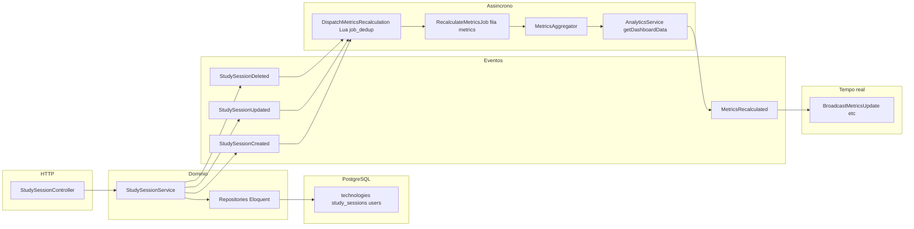

# Resumo arquitetural StudyTrack Pro

Consolidação do funcionamento do monorepo **StudyTrack Pro**: **frontend** (`[frontend/](../../frontend/)`, Vue 3), **backend** (`[backend/](../../backend/)`, Laravel 11+), integração **HTTP JSON**, **PostgreSQL** (schemas separados), **Redis** (scripts Lua), **filas** e **WebSocket** (Laravel Reverb + Echo).

Para a ordem detalhada de execução HTTP e da SPA, ver também [FLUXO_COMPLETO_STUDYTRACK_PRO.md](FLUXO_COMPLETO_STUDYTRACK_PRO.md).

---

## Visão geral do produto

A aplicação é um **rastreador de estudos**: o utilizador gere **tecnologias** (áreas/tópicos), regista **sessões de estudo** (duração, tecnologia, timestamps), consulta **analytics** agregados (dashboard, heatmap, séries temporais, export) e pode usar **timer/sessão ativa**. A UX de **metas (goals)** é em grande parte **só no frontend** (localStorage), sem endpoints no backend — ver `[frontend/src/api/modules/goals.api.ts](../../frontend/src/api/modules/goals.api.ts)` e [operations/GOALS-FRONTEND-ONLY.md](../operations/GOALS-FRONTEND-ONLY.md).

---

## Stack e responsabilidades

| Camada        | Tecnologia                                 | Papel                                                                         |
| ------------- | ------------------------------------------ | ----------------------------------------------------------------------------- |
| UI            | Vue 3, PrimeVue, Pinia, TanStack Vue Query | Rotas, formulários, estado global, cache de servidor                          |
| API           | Laravel, prefixo `/api/v1`                 | Autenticação Sanctum, CRUD, analytics, health                                 |
| BD            | PostgreSQL                                 | Dados transacionais + tabelas de analytics                                    |
| Cache / infra | Redis                                      | Tags de cache analytics, blacklist de tokens, Lua (rate limit, dedup, streak) |
| Assíncrono    | Redis queue, jobs                          | Recálculo de métricas, resumos semanais                                       |
| Tempo real    | Reverb (protocolo Pusher), Laravel Echo    | Canal privado `dashboard.{userId}`                                            |

---

## Backend: entrada HTTP e camadas

### Rotas principais

O ficheiro `[backend/routes/api.php](../../backend/routes/api.php)` define:

- **Broadcast auth**: `Broadcast::routes` com `auth:sanctum` (subscrição a canais privados).
- **Grupo `v1`**: registo/login com throttles dedicados; resto autenticado com `auth:sanctum`.
- **Leitura**: tecnologias, sessões (lista/detalhe/ativa), vários endpoints sob `analytics/*` (dashboard, user-metrics, tech-stats, time-series, weekly, heatmap, export).
- **Escrita**: logout, perfil, CRUD tecnologias, CRUD/patch de sessões, `study-sessions/start` e `.../end`, `analytics/recalculate`.
- Várias rotas de escrita usam middleware `**throttle.sliding`** (Lua no Redis) em vez de só throttle por minuto.
- **Health**: `GET health` (fora do prefixo `v1` no mesmo ficheiro).

### Bootstrap e middleware da API

Em `[backend/bootstrap/app.php](../../backend/bootstrap/app.php)`: routing API, canais, alias `throttle.sliding` → `SlidingWindowRateLimit`, e stack com middleware como `**EnsureJsonResponse`**, `**SetUserTimezone**`, `**LogApiRequests**`.

### Arquitetura modular (domínio)

Em `backend/app/Modules/` existem módulos por contexto (**Auth**, **StudySessions**, **Technologies**, **Analytics**) com **serviços**, **repositórios Eloquent** e **DTOs**. Os bindings interface → implementação estão em `[backend/app/Providers/RepositoryServiceProvider.php](../../backend/app/Providers/RepositoryServiceProvider.php)`.

Os **controllers HTTP** em `[backend/app/Http/Controllers/V1/](../../backend/app/Http/Controllers/V1/)` delegam aos serviços dos módulos.

### Autenticação e tokens

- **Laravel Sanctum** (`auth:sanctum`), modelo `[backend/app/Models/User.php](../../backend/app/Models/User.php)` com `HasApiTokens`.
- `[backend/app/Modules/Auth/Services/TokenService.php](../../backend/app/Modules/Auth/Services/TokenService.php)` e **AuthService** para login/registo, revogação e **blacklist em Redis** (pipeline), além dos tokens na tabela `personal_access_tokens`.

### Modelos Eloquent e relações principais

- **Transacional (schema público)**: `User`, `Technology`, `StudySession` — `User` tem muitas tecnologias/sessões; `Technology` tem muitas sessões; `StudySession` pertence a utilizador e tecnologia.
- **Analytics (schema `analytics`)**: `UserMetrics`, `TechnologyMetrics`, `DailyMinutes`, `WeeklySummary` — chaves compostas ou `user_id` como PK onde aplicável; migração base em `[backend/database/migrations/analytics/2025_01_02_000002_create_analytics_tables.php](../../backend/database/migrations/analytics/2025_01_02_000002_create_analytics_tables.php)`.

Migrações em `database/migrations/transactional/` criam utilizadores, tecnologias, sessões, tokens, índices, triggers e funções. O projeto assume **PostgreSQL** (extensões, schemas, JSONB em weekly summaries).

---

## Fluxo de dados no backend: sessão → eventos → fila → métricas → broadcast

O mapeamento central está em `[backend/app/Providers/EventServiceProvider.php](../../backend/app/Providers/EventServiceProvider.php)`:

- **Alteração em sessão** dispara eventos de domínio (`StudySessionCreated` / `Updated` / `Deleted`).
- **Listeners** invalidam cache de sessões, **agendam recálculo** (`DispatchMetricsRecalculation`), e em alguns casos fazem **broadcast** de sessão iniciada/terminada e métricas a recalcular.
- `[backend/app/Listeners/StudySession/DispatchMetricsRecalculation.php](../../backend/app/Listeners/StudySession/DispatchMetricsRecalculation.php)` usa **Lua `job_dedup`** via `[backend/app/Services/RedisLuaService.php](../../backend/app/Services/RedisLuaService.php)` para evitar enfileirar múltiplos jobs para o mesmo utilizador; em falha Redis faz **fail-open**. O job é `**RecalculateMetricsJob`** com **delay de 2s** para agrupar escritas.
- `[backend/app/Jobs/RecalculateMetricsJob.php](../../backend/app/Jobs/RecalculateMetricsJob.php)`: `ShouldQueue` + `**ShouldBeUnique` por `userId`**, fila `metrics`; dentro de **transação DB** chama o agregador para `**user_metrics`**, `**technology_metrics**`, `**daily_minutes**`; depois **flush de cache** com tags `analytics` e `analytics:user:{id}`; obtém snapshot do dashboard e dispara `**MetricsRecalculated`**, que atualiza cache e **broadcast** para o frontend.

### Scripts Redis Lua (repositório)

Ficheiros em `[redis-scripts/](../../redis-scripts/)` (preload via `[backend/app/Providers/RedisScriptServiceProvider.php](../../backend/app/Providers/RedisScriptServiceProvider.php)`):

- `**job_dedup`**: deduplicação do dispatch de jobs de métricas.
- `**sliding_window**`: rate limiting deslizante (middleware API).
- `**streak_update**`: usado por `[backend/app/Services/StreakService.php](../../backend/app/Services/StreakService.php)` (complementar à persistência em analytics).

### Agendamento (scheduler)

`[backend/routes/console.php](../../backend/routes/console.php)`: jobs agendados (ex.: resumo semanal em `analytics.weekly_summaries`, prune de jobs falhados).

---

## Broadcasting e WebSocket

- **Canais**: `[backend/routes/channels.php](../../backend/routes/channels.php)` — canal privado `dashboard.{userId}` só se o ID autenticado coincidir.
- **Config**: `[backend/config/broadcasting.php](../../backend/config/broadcasting.php)` — driver **Reverb** quando as variáveis de ambiente estão definidas; caso contrário pode cair em `**log`** (dev sem servidor WS).
- **Eventos `ShouldBroadcast`**: métricas recalculadas / a recalcular, sessão iniciada/terminada (`app/Events/`).
- **Health**: `[backend/app/Http/Controllers/HealthController.php](../../backend/app/Http/Controllers/HealthController.php)` verifica DB, Redis, fila e probe TCP ao host/porto do Reverb.

---

## Frontend: arranque, auth e dados

### Arranque

`[frontend/src/main.ts](../../frontend/src/main.ts)`: Pinia, **Vue Query** (retry evitando 401/403 e `SESSION_NOT_READY`), Router, PrimeVue, tema em `localStorage` (`studytrack.theme`) e `data-theme` no `document`.

### Rotas e guardas

- Router em `[frontend/src/router/index.ts](../../frontend/src/router/index.ts)`; rotas autenticadas sob `[frontend/src/components/layout/AppLayout.vue](../../frontend/src/components/layout/AppLayout.vue)` com `meta.requiresAuth`.
- `[frontend/src/router/guards.ts](../../frontend/src/router/guards.ts)`: convidado autenticado → dashboard; com token e `sessionValidated === false` força `**fetchMe()`** antes de rotas protegidas.

### Cliente API

`[frontend/src/api/client.ts](../../frontend/src/api/client.ts)`: Axios com `baseURL` → `VITE_API_URL + '/api/v1'`, **Bearer**, bloqueio de pedidos (exceto `/auth/me` e logout) até `**sessionValidated`**, **401** (limpa sessão → login), **429** (toast opcional).

### Estado e sincronização com o servidor

- **Pinia**: `auth`, `analytics`, `sessions`, `technologies`, `notifications`, `ui`, `goals`.
- **TanStack Query**: queries com `**enabled`** ligado à sessão validada (ex.: `useQueryAuthEnabled`).
- **Padrão híbrido**: dashboard/tecnologias espelham dados em stores; lista de sessões muitas vezes **infinite query**; **store de sessões** cobre sessão ativa/timer e WS.

### WebSocket no browser

`[frontend/src/composables/useWebSocket.ts](../../frontend/src/composables/useWebSocket.ts)`: Echo + Pusher; canal `**dashboard.{userId}`**; `authEndpoint` `/api/broadcasting/auth` com Bearer; eventos `.metrics.updated`, `.metrics.recalculating`, `.session.started`, `.session.ended`; invalidação de queries; fallback por timeout se o payload de fim de recálculo falhar. Desativável com `VITE_REVERB_ENABLED=false`.

`[frontend/src/features/dashboard/composables/useDashboard.ts](../../frontend/src/features/dashboard/composables/useDashboard.ts)`: **polling** quando WS desligado e **refetch** em `visibilitychange`.

---

## Fluxo ponta a ponta (exemplo: iniciar e terminar sessão)

1. UI chama `[frontend/src/api/modules/sessions.api.ts](../../frontend/src/api/modules/sessions.api.ts)` (`POST study-sessions/start` ou `PATCH .../end`).
2. Axios envia o pedido autenticado → **StudySessionController**.
3. Serviço persiste em **PostgreSQL** (`study_sessions`, FKs para `technologies` / `users`).
4. Eventos de domínio → listeners: invalidação de cache, dedup + **RecalculateMetricsJob**, broadcasts.
5. Worker processa o job: agrega `**analytics.*`**, flush de **cache tagged**, **MetricsRecalculated**.
6. Cliente Echo recebe atualizações e/ou invalida queries; sem WS, polling/refetch.

---

## Interação com a base de dados (resumo)

- **Escrita transacional**: CRUD em `users`, `technologies`, `study_sessions` (+ tokens Sanctum, `failed_jobs`).
- **Escrita analítica**: sobretudo via **job de recálculo** e jobs agendados (ex.: weekly summary no schema analytics).
- **Triggers / funções** (`transactional/`): consistência e campos derivados na BD.
- **Leitura na API**: repositórios/serviços leem transacional + `**analytics.*`**; dashboard **cacheado** por tags até flush após recálculo.

---

## Operação e ambiente

- **Filas**: ligação típica `redis`; filas nomeadas (`metrics`, `scheduler`, …).
- **Health**: DB, Redis, fila, Reverb (TCP).
- **Rate limits** em `api.php` + **sliding window** Lua em rotas sensíveis de sessão.

---

## Ficheiros de referência rápida

| Área             | Caminho                                                                                                                                                                            |
| ---------------- | ---------------------------------------------------------------------------------------------------------------------------------------------------------------------------------- |
| API HTTP         | `[backend/routes/api.php](../../backend/routes/api.php)`                                                                                                                           |
| Eventos          | `[backend/app/Providers/EventServiceProvider.php](../../backend/app/Providers/EventServiceProvider.php)`                                                                           |
| Job de métricas  | `[backend/app/Jobs/RecalculateMetricsJob.php](../../backend/app/Jobs/RecalculateMetricsJob.php)`                                                                                   |
| Dedup Lua        | `[backend/app/Listeners/StudySession/DispatchMetricsRecalculation.php](../../backend/app/Listeners/StudySession/DispatchMetricsRecalculation.php)`                                 |
| Schema analytics | `[backend/database/migrations/analytics/2025_01_02_000002_create_analytics_tables.php](../../backend/database/migrations/analytics/2025_01_02_000002_create_analytics_tables.php)` |
| Cliente HTTP     | `[frontend/src/api/client.ts](../../frontend/src/api/client.ts)`                                                                                                                   |
| Auth store       | `[frontend/src/stores/auth.store.ts](../../frontend/src/stores/auth.store.ts)`                                                                                                     |
| WebSocket        | `[frontend/src/composables/useWebSocket.ts](../../frontend/src/composables/useWebSocket.ts)`                                                                                       |
| Canais broadcast | `[backend/routes/channels.php](../../backend/routes/channels.php)`                                                                                                                 |

