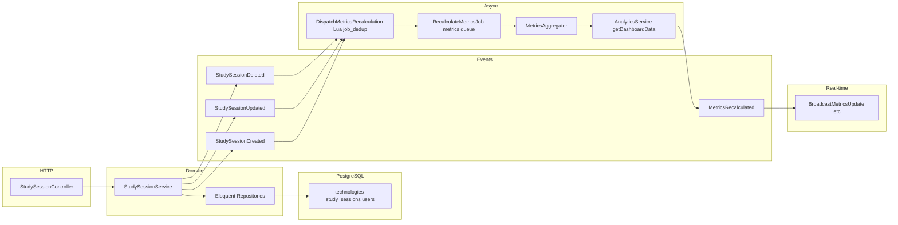

# StudyTrack Pro Architectural Summary

Consolidation of how the **StudyTrack Pro** monorepo works: **frontend** (`[frontend/](../../frontend/)`, Vue 3), **backend** (`[backend/](../../backend/)`, Laravel 11+), **HTTP JSON** integration, **PostgreSQL** (separate schemas), **Redis** (Lua scripts), **queues**, and **WebSocket** (Laravel Reverb + Echo).

For the detailed HTTP and SPA execution order, also see [FLUXO_COMPLETO_STUDYTRACK_PRO.md](FLUXO_COMPLETO_STUDYTRACK_PRO.md).

---

## Product Overview

The application is a **study tracker**: the user manages **technologies** (areas/topics), logs **study sessions** (duration, technology, timestamps), views **aggregated analytics** (dashboard, heatmap, time series, export), and can use **timer/active session**. The **goals** UX is largely **frontend-only** (localStorage), without backend endpoints — see `[frontend/src/api/modules/goals.api.ts](../../frontend/src/api/modules/goals.api.ts)` and [operations/GOALS-FRONTEND-ONLY.md](../operations/GOALS-FRONTEND-ONLY.md).

---

## Stack and Responsibilities

| Layer | Technology | Role |
|-------|------------|------|
| UI | Vue 3, PrimeVue, Pinia, TanStack Vue Query | Routes, forms, global state, server cache |
| API | Laravel, `/api/v1` prefix | Sanctum authentication, CRUD, analytics, health |
| DB | PostgreSQL | Transactional data + analytics tables |
| Cache / infra | Redis | Analytics cache tags, token blacklist, Lua (rate limit, dedup, streak) |
| Async | Redis queue, jobs | Metrics recalculation, weekly summaries |
| Real-time | Reverb (Pusher protocol), Laravel Echo | Private channel `dashboard.{userId}` |

---

## Backend: HTTP Entry and Layers

### Main Routes

The file `[backend/routes/api.php](../../backend/routes/api.php)` defines:

- **Broadcast auth**: `Broadcast::routes` with `auth:sanctum` (private channel subscription).
- **`v1` group**: registration/login with dedicated throttles; rest authenticated with `auth:sanctum`.
- **Reads**: technologies, sessions (list/detail/active), various endpoints under `analytics/*` (dashboard, user-metrics, tech-stats, time-series, weekly, heatmap, export).
- **Writes**: logout, profile, technology CRUD, session CRUD/patch, `study-sessions/start` and `.../end`, `analytics/recalculate`.
- Several write routes use **`throttle.sliding`** middleware (Lua on Redis) instead of just per-minute throttle.
- **Health**: `GET health` (outside the `v1` prefix in the same file).

### API Bootstrap and Middleware

In `[backend/bootstrap/app.php](../../backend/bootstrap/app.php)`: API routing, channels, `throttle.sliding` alias → `SlidingWindowRateLimit`, and stack with middleware like **`EnsureJsonResponse`**, **`SetUserTimezone`**, **`LogApiRequests`**.

### Domain Modular Architecture

In `backend/app/Modules/` there are modules by context (**Auth**, **StudySessions**, **Technologies**, **Analytics**) with **services**, **Eloquent repositories**, and **DTOs**. Interface → implementation bindings are in `[backend/app/Providers/RepositoryServiceProvider.php](../../backend/app/Providers/RepositoryServiceProvider.php)`.

The **HTTP controllers** in `[backend/app/Http/Controllers/V1/](../../backend/app/Http/Controllers/V1/)` delegate to module services.

### Authentication and Tokens

- **Laravel Sanctum** (`auth:sanctum`), model `[backend/app/Models/User.php](../../backend/app/Models/User.php)` with `HasApiTokens`.
- `[backend/app/Modules/Auth/Services/TokenService.php](../../backend/app/Modules/Auth/Services/TokenService.php)` and **AuthService** for login/registration, revocation, and **Redis blacklist** (pipeline), plus tokens in the `personal_access_tokens` table.

### Eloquent Models and Main Relationships

- **Transactional (public schema)**: `User`, `Technology`, `StudySession` — `User` has many technologies/sessions; `Technology` has many sessions; `StudySession` belongs to user and technology.
- **Analytics (`analytics` schema)**: `UserMetrics`, `TechnologyMetrics`, `DailyMinutes`, `WeeklySummary` — composite keys or `user_id` as PK where applicable; base migration in `[backend/database/migrations/analytics/2025_01_02_000002_create_analytics_tables.php](../../backend/database/migrations/analytics/2025_01_02_000002_create_analytics_tables.php)`.

Migrations in `database/migrations/transactional/` create users, technologies, sessions, tokens, indexes, triggers, and functions. The project assumes **PostgreSQL** (extensions, schemas, JSONB in weekly summaries).

---

## Data Flow in Backend: Session → Events → Queue → Metrics → Broadcast

The central mapping is in `[backend/app/Providers/EventServiceProvider.php](../../backend/app/Providers/EventServiceProvider.php)`:

```mermaid
flowchart LR
  subgraph http [HTTP]
    C[StudySessionController]
  end
  subgraph domain [Domain]
    S[StudySessionService]
    R[Eloquent Repositories]
  end
  subgraph pg [PostgreSQL]
    T[technologies study_sessions users]
  end
  subgraph events [Events]
    EC[StudySessionCreated]
    EU[StudySessionUpdated]
    ED[StudySessionDeleted]
    MR[MetricsRecalculated]
  end
  subgraph async [Async]
    L[DispatchMetricsRecalculation Lua job_dedup]
    J[RecalculateMetricsJob metrics queue]
    Agg[MetricsAggregator]
    Ana[AnalyticsService getDashboardData]
  end
  subgraph realtime [Real-time]
    BC[BroadcastMetricsUpdate etc]
  end
  C --> S --> R --> T
  S --> EC
  S --> EU
  S --> ED
  EC --> L
  EU --> L
  ED --> L
  L --> J
  J --> Agg
  Agg --> Ana
  Ana --> MR
  MR --> BC
```

- **Session change** dispatches domain events (`StudySessionCreated` / `Updated` / `Deleted`).
- **Listeners** invalidate session cache, **schedule recalculation** (`DispatchMetricsRecalculation`), and in some cases **broadcast** session started/ended and metrics being recalculated.
- `[backend/app/Listeners/StudySession/DispatchMetricsRecalculation.php](../../backend/app/Listeners/StudySession/DispatchMetricsRecalculation.php)` uses **Lua `job_dedup`** via `[backend/app/Services/RedisLuaService.php](../../backend/app/Services/RedisLuaService.php)` to avoid enqueueing multiple jobs for the same user; on Redis failure it does **fail-open**. The job is **`RecalculateMetricsJob`** with a **2s delay** to batch writes.
- `[backend/app/Jobs/RecalculateMetricsJob.php](../../backend/app/Jobs/RecalculateMetricsJob.php)`: `ShouldQueue` + **`ShouldBeUnique` per `userId`**, `metrics` queue; within a **DB transaction** it calls the aggregator for **`user_metrics`**, **`technology_metrics`**, **`daily_minutes`**; then **flushes cache** with tags `analytics` and `analytics:user:{id}`; obtains a dashboard snapshot and dispatches **`MetricsRecalculated`**, which updates cache and **broadcasts** to the frontend.

### Redis Lua Scripts (Repository)

Files in `[redis-scripts/](../../redis-scripts/)` (preloaded via `[backend/app/Providers/RedisScriptServiceProvider.php](../../backend/app/Providers/RedisScriptServiceProvider.php)`):

- **`job_dedup`**: deduplication of metrics job dispatches.
- **`sliding_window`**: sliding rate limiting (API middleware).
- **`streak_update`**: used by `[backend/app/Services/StreakService.php](../../backend/app/Services/StreakService.php)` (complementary to analytics persistence).

### Scheduling (Scheduler)

`[backend/routes/console.php](../../backend/routes/console.php)`: scheduled jobs (e.g., weekly summary in `analytics.weekly_summaries`, failed job pruning).

---

## Broadcasting and WebSocket

- **Channels**: `[backend/routes/channels.php](../../backend/routes/channels.php)` — private channel `dashboard.{userId}` only if the authenticated ID matches.
- **Config**: `[backend/config/broadcasting.php](../../backend/config/broadcasting.php)` — **Reverb** driver when environment variables are defined; otherwise it may fall back to **`log`** (dev without WS server).
- **`ShouldBroadcast` events**: recalculated / recalculating metrics, session started/ended (`app/Events/`).
- **Health**: `[backend/app/Http/Controllers/HealthController.php](../../backend/app/Http/Controllers/HealthController.php)` checks DB, Redis, queue, and TCP probe to Reverb host/port.

---

## Frontend: Startup, Auth, and Data

### Startup

`[frontend/src/main.ts](../../frontend/src/main.ts)`: Pinia, **Vue Query** (retry avoiding 401/403 and `SESSION_NOT_READY`), Router, PrimeVue, theme in `localStorage` (`studytrack.theme`) and `data-theme` on `document`.

### Routes and Guards

- Router in `[frontend/src/router/index.ts](../../frontend/src/router/index.ts)`; authenticated routes under `[frontend/src/components/layout/AppLayout.vue](../../frontend/src/components/layout/AppLayout.vue)` with `meta.requiresAuth`.
- `[frontend/src/router/guards.ts](../../frontend/src/router/guards.ts)`: authenticated guest → dashboard; with token and `sessionValidated === false` forces **`fetchMe()`** before protected routes.

### API Client

`[frontend/src/api/client.ts](../../frontend/src/api/client.ts)`: Axios with `baseURL` → `VITE_API_URL + '/api/v1'`, **Bearer**, request blocking (except `/auth/me` and logout) until **`sessionValidated`**, **401** (clear session → login), **429** (optional toast).

### State and Server Synchronization

- **Pinia**: `auth`, `analytics`, `sessions`, `technologies`, `notifications`, `ui`, `goals`.
- **TanStack Query**: queries with **`enabled`** tied to validated session (e.g., `useQueryAuthEnabled`).
- **Hybrid pattern**: dashboard/technologies mirror data in stores; session list often uses **infinite query**; **session store** covers active session/timer and WS.

### Browser WebSocket

`[frontend/src/composables/useWebSocket.ts](../../frontend/src/composables/useWebSocket.ts)`: Echo + Pusher; channel **`dashboard.{userId}`**; `authEndpoint` `/api/broadcasting/auth` with Bearer; events `.metrics.updated`, `.metrics.recalculating`, `.session.started`, `.session.ended`; query invalidation; timeout fallback if the recalculation end payload fails. Can be disabled with `VITE_REVERB_ENABLED=false`.

`[frontend/src/features/dashboard/composables/useDashboard.ts](../../frontend/src/features/dashboard/composables/useDashboard.ts)`: **polling** when WS is off and **refetch** on `visibilitychange`.

---

## End-to-End Flow (Example: Start and End Session)

1. UI calls `[frontend/src/api/modules/sessions.api.ts](../../frontend/src/api/modules/sessions.api.ts)` (`POST study-sessions/start` or `PATCH .../end`).
2. Axios sends the authenticated request → **StudySessionController**.
3. Service persists in **PostgreSQL** (`study_sessions`, FKs to `technologies` / `users`).
4. Domain events → listeners: cache invalidation, dedup + **RecalculateMetricsJob**, broadcasts.
5. Worker processes the job: aggregates **`analytics.*`**, flushes **tagged cache**, dispatches **MetricsRecalculated**.
6. Echo client receives updates and/or invalidates queries; without WS, polling/refetch.

---

## Database Interaction (Summary)

- **Transactional writes**: CRUD on `users`, `technologies`, `study_sessions` (+ Sanctum tokens, `failed_jobs`).
- **Analytical writes**: mainly via **recalculation job** and scheduled jobs (e.g., weekly summary in analytics schema).
- **Triggers / functions** (`transactional/`): consistency and derived fields in the DB.
- **API reads**: repositories/services read transactional + **`analytics.*`**; dashboard **cached** by tags until flush after recalculation.

---

## Operations and Environment

- **Queues**: typical `redis` connection; named queues (`metrics`, `scheduler`, …).
- **Health**: DB, Redis, queue, Reverb (TCP).
- **Rate limits** in `api.php` + **sliding window** Lua on sensitive session routes.

---

## Quick Reference Files

| Area | Path |
|------|------|
| HTTP API | `[backend/routes/api.php](../../backend/routes/api.php)` |
| Events | `[backend/app/Providers/EventServiceProvider.php](../../backend/app/Providers/EventServiceProvider.php)` |
| Metrics Job | `[backend/app/Jobs/RecalculateMetricsJob.php](../../backend/app/Jobs/RecalculateMetricsJob.php)` |
| Lua Dedup | `[backend/app/Listeners/StudySession/DispatchMetricsRecalculation.php](../../backend/app/Listeners/StudySession/DispatchMetricsRecalculation.php)` |
| Analytics Schema | `[backend/database/migrations/analytics/2025_01_02_000002_create_analytics_tables.php](../../backend/database/migrations/analytics/2025_01_02_000002_create_analytics_tables.php)` |
| HTTP Client | `[frontend/src/api/client.ts](../../frontend/src/api/client.ts)` |
| Auth Store | `[frontend/src/stores/auth.store.ts](../../frontend/src/stores/auth.store.ts)` |
| WebSocket | `[frontend/src/composables/useWebSocket.ts](../../frontend/src/composables/useWebSocket.ts)` |
| Broadcast Channels | `[backend/routes/channels.php](../../backend/routes/channels.php)` |
